# Training Run Report

- generated_at: `2026-05-14 19:04:24`
- base_dir: `/outputs/runs`
- xai_dir: `/workspace/visualizations/xai`
- runs: `13`
- sort_by: `best_composite_score`

## Comparison

| run | duration | stopped_epoch | best_epoch | best_composite | best_dice | best_iou | best_sens | best_prec | best_hd95 | model | loss | patch_size |
| --- | --- | --- | --- | --- | --- | --- | --- | --- | --- | --- | --- | --- |
| 20260415_210631_v3_multimodal | 2:41:19 | 74 | 14 | 0.5285 | 0.3182 | 0.2155 | 0.7893 | n/a | n/a | attention_unet3d | tversky_bce | (20, 128, 128) |
| 20260415_173357_v3_multimodal | 3:16:35 | 91 | 38 | 0.5278 | 0.3472 | 0.2423 | 0.7603 | n/a | n/a | attention_unet3d | tversky_bce | (20, 128, 128) |
| 20260513_210500_deconver_tuned_a | 1:43:11 | 140 | 52 | 0.5123 | 0.5064 | 0.3744 | 0.5341 | 0.7284 | 11.4219 | deconver | tversky_bce | (16, 128, 128) |
| 20260507_193114_deconver_tuned_a | 55:23:54 | 140 | 96 | 0.4772 | 0.4373 | 0.3203 | 0.6095 | 0.4974 | 43.5947 | deconver | tversky_bce | (16, 128, 128) |
| 20260418_224246_deconver | 7:19:20 | 139 | 122 | 0.4709 | 0.4067 | 0.2859 | 0.6567 | 0.4451 | 58.3092 | deconver | tversky_bce | (16, 128, 128) |
| 20260514_153746_deconver_tuned_a | 0:18:24 | 25 | 10 | 0.4646 | 0.4728 | 0.3419 | 0.4586 | 0.6755 | 19.9069 | deconver | tversky_bce | (16, 128, 128) |
| 20260427_221309_unet3d | 13:25:46 | 300 | 276 | 0.4409 | 0.4152 | 0.3042 | 0.5181 | 0.5335 | 39.3815 | attention_unet3d | tversky_bce | (16, 128, 128) |
| 20260513_105631_deconver_multitask_a | 9:59:57 | 26 | 4 | 0.4377 | 0.4313 | 0.3118 | 0.5606 | 0.5256 | 45.8476 | deconver_multitask | tversky_bce | (16, 128, 128) |
| 20260416_112700_v3_multimodal | 7:26:21 | 170 | 146 | 0.4323 | 0.3620 | 0.2547 | 0.6184 | 0.4602 | 55.2121 | attention_unet3d | tversky_bce | (20, 128, 128) |
| 20260507_205845_fct_default | 44:06:05 | 300 | 268 | 0.4311 | 0.4149 | 0.2979 | 0.5023 | 0.7547 | 51.4333 | fct | tversky_bce | (16, 128, 128) |
| 20260416_193800_v3_multimodal | 12:08:57 | 300 | 206 | 0.4166 | 0.3732 | 0.2650 | 0.5171 | 0.4833 | 79.1391 | attention_unet3d | tversky_bce | (20, 128, 128) |
| 20260420_212454_deconver | 9:31:29 | 210 | 145 | 0.3970 | 0.3458 | 0.2420 | 0.5495 | 0.4670 | 54.6309 | deconver | tversky_bce | (16, 128, 128) |
| 20260426_104802_v3_multimodal | 2:10:08 | 150 | 118 | 0.3718 | 0.3108 | 0.2137 | 0.4736 | 0.4607 | 105.9377 | attention_unet3d | tversky_bce | (16, 128, 128) |

## 20260415_210631_v3_multimodal

- run_dir: `/outputs/runs/20260415_210631_v3_multimodal`
- experiment_name: `v3_multimodal`
- git_commit: `unknown`
- config_source: `metadata.json`
- start_time: `2026-04-15 21:11:03`
- end_time: `2026-04-15 23:52:22`
- duration: `2:41:19`
- epochs: stopped=74, configured=300, best=14
- early_stopped: `True`

### Visualization

### Explainability (XAI)
- xai_summary: [`20260415_210631_v3_multimodal_10726_1000742_summary.json`](visualizations/xai/20260415_210631_v3_multimodal_10726_1000742_summary.json)
- generated_at: `2026-05-12T16:17:03`
- case_id: `10726_1000742`
- gradcam_target_layer: `bottleneck`

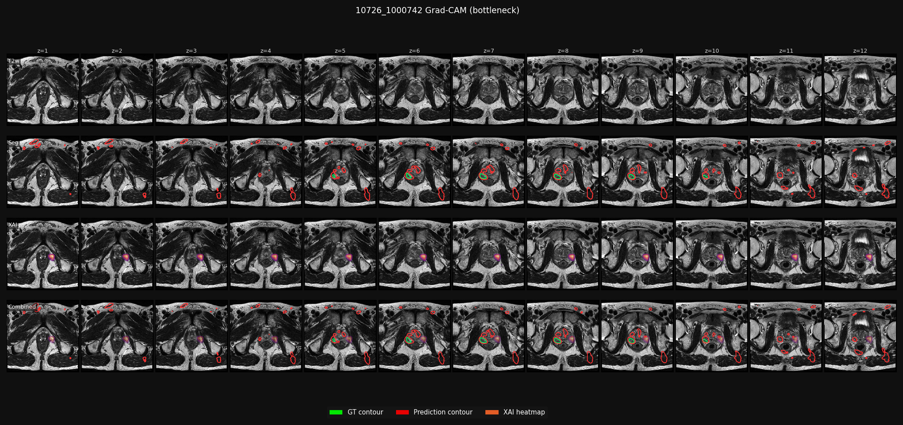

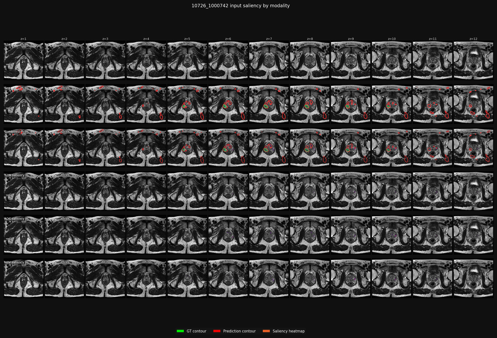

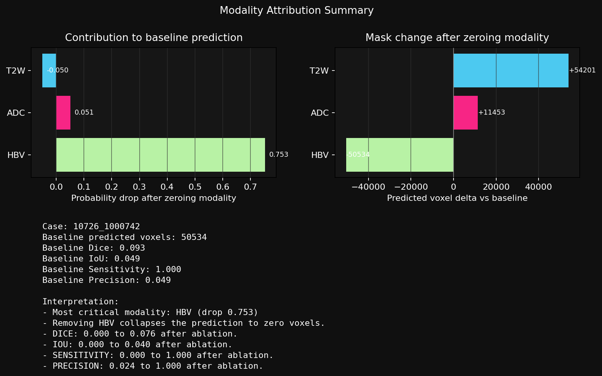

- saliency_channels: `adc, hbv, t2w`

#### Modality Ablation

| modality_zeroed | prob_drop | voxel_delta | dice | iou | sensitivity | precision |
| --- | --- | --- | --- | --- | --- | --- |
| t2w | -0.0497 | 54201 | 0.0460 | 0.0235 | 1.0000 | 0.0235 |
| adc | 0.0506 | 11453 | 0.0765 | 0.0398 | 1.0000 | 0.0398 |
| hbv | 0.7528 | -50534 | 0.0000 | 0.0000 | 0.0000 | 1.0000 |

### Evaluation
- checkpoint: `best.pt`
- test_cases: `10` (`5` positive, `5` negative)

| Metric | Value |
| --- | --- |
| dice | 0.1291 |
| iou | 0.0710 |
| sensitivity | 0.9552 |
| precision | 0.0715 |
| hd95 | 181.4493 |

### Training Validation Metrics

| Metric | Best | At Best Epoch | Last Val |
| --- | --- | --- | --- |
| composite_score | 0.5285 | 0.5285 | 0.4397 |
| dice | 0.3182 | 0.0938 | 0.2998 |
| iou | 0.2155 | 0.0544 | 0.1990 |
| sensitivity | 0.7893 | 0.7893 | 0.5237 |
| precision | n/a | n/a | n/a |
| hd95 | n/a | n/a | n/a |

### Config Highlights
- model: `attention_unet3d`
- features: `[32, 64, 128, 256]`
- loss: `tversky_bce` (alpha=0.3, beta=0.7, dice_weight=3.0, bce_weight=1.0, bce_pos_weight=50.0)
- patch_size: `[20, 128, 128]`
- target_spacing: `[3.0, 0.5, 0.5]`
- modalities: use_t2w=True, use_adc=True, use_hbv=True
- optimizer/schedule: lr=0.0004, weight_decay=1e-05, warmup_epochs=10
- train/val cadence: batch_size=16, epochs=300, val_every=2, val_start_epoch=n/a, val_compute_hd95_every=0
- best-checkpoint score weights: w_sensitivity=0.5, w_dice=0.3, w_hd95=0.0, hd95_scale=n/a
- early stopping: patience=30, min_delta=0.001
- runtime: use_amp=True, amp_dtype=fp16, use_compile=False
- encoder init: pretrained_encoder_checkpoint=n/a, freeze_encoder_epochs=n/a
- parameters: total=22,668,733, trainable=22,668,733

### Warnings
- metadata.json config differs from config.yaml; using metadata.json (mismatched keys: sw_batch_size).

## 20260415_173357_v3_multimodal

- run_dir: `/outputs/runs/20260415_173357_v3_multimodal`
- experiment_name: `v3_multimodal`
- git_commit: `unknown`
- config_source: `metadata.json`
- start_time: `2026-04-15 17:38:30`
- end_time: `2026-04-15 20:55:05`
- duration: `3:16:35`
- epochs: stopped=91, configured=300, best=38
- early_stopped: `True`

### Visualization

### Explainability (XAI)
- xai_summary: [`20260415_173357_v3_multimodal_10726_1000742_summary.json`](visualizations/xai/20260415_173357_v3_multimodal_10726_1000742_summary.json)
- generated_at: `2026-05-12T16:17:36`
- case_id: `10726_1000742`
- gradcam_target_layer: `bottleneck`

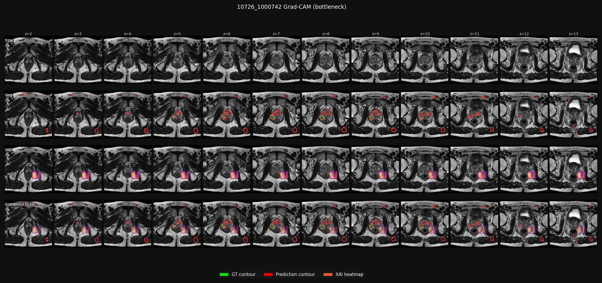

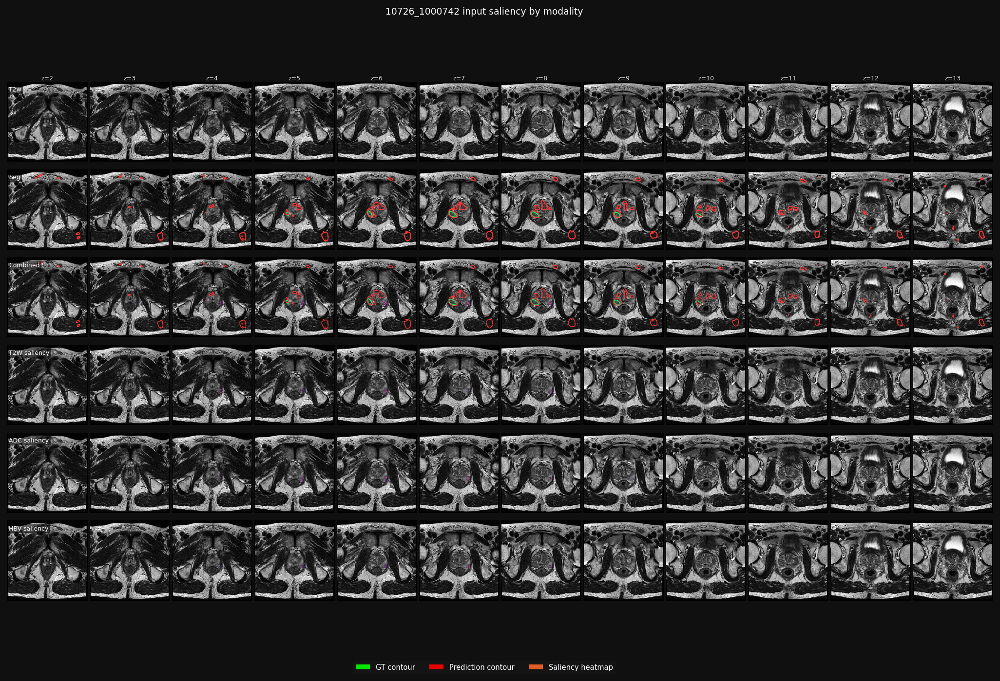

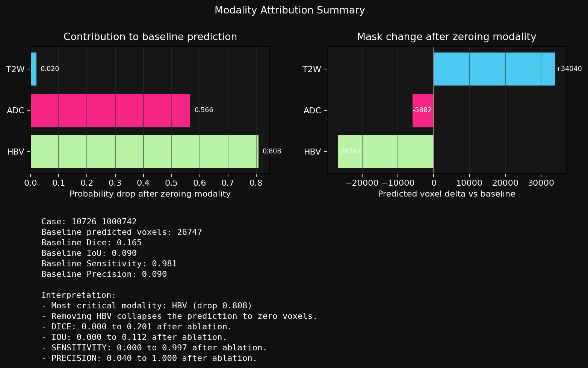

- saliency_channels: `adc, hbv, t2w`

#### Modality Ablation

| modality_zeroed | prob_drop | voxel_delta | dice | iou | sensitivity | precision |
| --- | --- | --- | --- | --- | --- | --- |
| t2w | 0.0203 | 34040 | 0.0777 | 0.0404 | 0.9972 | 0.0404 |
| adc | 0.5661 | -5882 | 0.2009 | 0.1117 | 0.9509 | 0.1123 |
| hbv | 0.8081 | -26747 | 0.0000 | 0.0000 | 0.0000 | 1.0000 |

### Evaluation
- checkpoint: `best.pt`
- test_cases: `10` (`5` positive, `5` negative)

| Metric | Value |
| --- | --- |
| dice | 0.2306 |
| iou | 0.1313 |
| sensitivity | 0.7699 |
| precision | 0.1411 |
| hd95 | 174.3303 |

### Training Validation Metrics

| Metric | Best | At Best Epoch | Last Val |
| --- | --- | --- | --- |
| composite_score | 0.5278 | 0.5278 | 0.4357 |
| dice | 0.3472 | 0.1852 | 0.3472 |
| iou | 0.2423 | 0.1135 | 0.2423 |
| sensitivity | 0.7603 | 0.7334 | 0.4888 |
| precision | n/a | n/a | n/a |
| hd95 | n/a | n/a | n/a |

### Config Highlights
- model: `attention_unet3d`
- features: `[32, 64, 128, 256]`
- loss: `tversky_bce` (alpha=0.3, beta=0.7, dice_weight=3.0, bce_weight=1.0, bce_pos_weight=50.0)
- patch_size: `[20, 128, 128]`
- target_spacing: `[3.0, 0.5, 0.5]`
- modalities: use_t2w=True, use_adc=True, use_hbv=True
- optimizer/schedule: lr=0.0004, weight_decay=1e-05, warmup_epochs=10
- train/val cadence: batch_size=16, epochs=300, val_every=2, val_start_epoch=n/a, val_compute_hd95_every=0
- best-checkpoint score weights: w_sensitivity=0.5, w_dice=0.3, w_hd95=0.0, hd95_scale=n/a
- early stopping: patience=30, min_delta=0.001
- runtime: use_amp=True, amp_dtype=fp16, use_compile=False
- encoder init: pretrained_encoder_checkpoint=n/a, freeze_encoder_epochs=n/a
- parameters: total=22,668,733, trainable=22,668,733

### Warnings
- metadata.json config differs from config.yaml; using metadata.json (mismatched keys: sw_batch_size).

## 20260513_210500_deconver_tuned_a

- run_dir: `/outputs/runs/20260513_210500_deconver_tuned_a`
- experiment_name: `deconver_tuned_a`
- git_commit: `unknown`
- config_source: `metadata.json`
- start_time: `2026-05-13 21:05:43`
- end_time: `2026-05-13 22:48:53`
- duration: `1:43:11`
- epochs: stopped=140, configured=140, best=52
- early_stopped: `False`

### Visualization

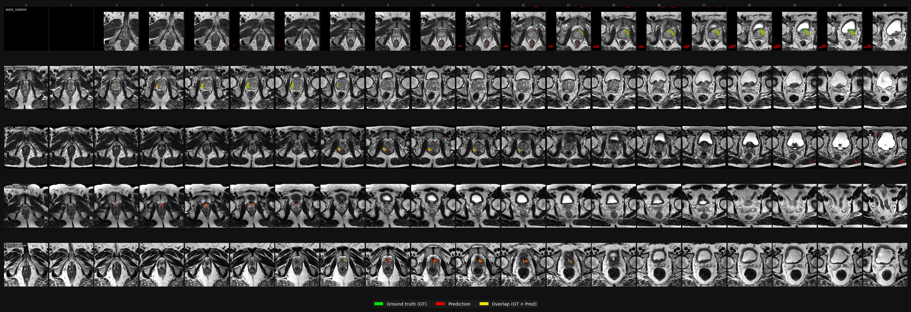

### Explainability (XAI)
- xai_summary: `n/a`

### Evaluation
- checkpoint: `best.pt`
- test_cases: `10` (`5` positive, `5` negative)

| Metric | Value |
| --- | --- |
| dice | 0.5030 |
| iou | 0.3569 |
| sensitivity | 0.9005 |
| precision | 0.3890 |
| hd95 | 99.6676 |

### Training Validation Metrics

| Metric | Best | At Best Epoch | Last Val |
| --- | --- | --- | --- |
| composite_score | 0.5123 | 0.5123 | 0.4194 |
| dice | 0.5064 | 0.5064 | 0.4335 |
| iou | 0.3744 | 0.3744 | 0.3105 |
| sensitivity | 0.5341 | 0.5212 | 0.3983 |
| precision | 0.7284 | 0.5265 | 0.6426 |
| hd95 | 11.4219 | 26.6939 | 15.9666 |

### Config Highlights
- model: `deconver`
- features: `[32, 64, 128, 256]`
- loss: `tversky_bce` (alpha=0.3, beta=0.7, dice_weight=1.0, bce_weight=1.0, bce_pos_weight=10.0)
- patch_size: `[16, 128, 128]`
- target_spacing: `[3.0, 0.5, 0.5]`
- modalities: use_t2w=True, use_adc=True, use_hbv=True
- optimizer/schedule: lr=0.0001, weight_decay=1e-05, warmup_epochs=8
- train/val cadence: batch_size=2, epochs=140, val_every=2, val_start_epoch=1, val_compute_hd95_every=1
- best-checkpoint score weights: w_sensitivity=0.4, w_dice=0.6, w_hd95=0.0, hd95_scale=10.0
- early stopping: patience=50, min_delta=0.001
- runtime: use_amp=True, amp_dtype=bf16, use_compile=False
- encoder init: pretrained_encoder_checkpoint=/outputs/pretrain_runs/20260505_215426_ssl_pretrain_deconver_mae/checkpoints/best.pt, freeze_encoder_epochs=0
- parameters: total=10,478,659, trainable=10,478,659

### Warnings
- Using centralized eval PNG from visualizations directory: 20260513_210500_deconver_tuned_a_eval_visualization.png

## 20260507_193114_deconver_tuned_a

- run_dir: `/outputs/runs/20260507_193114_deconver_tuned_a`
- experiment_name: `deconver_tuned_a`
- git_commit: `unknown`
- config_source: `metadata.json`
- start_time: `2026-05-07 19:36:15`
- end_time: `2026-05-10 03:00:09`
- duration: `55:23:54`
- epochs: stopped=140, configured=140, best=96
- early_stopped: `False`

### Visualization

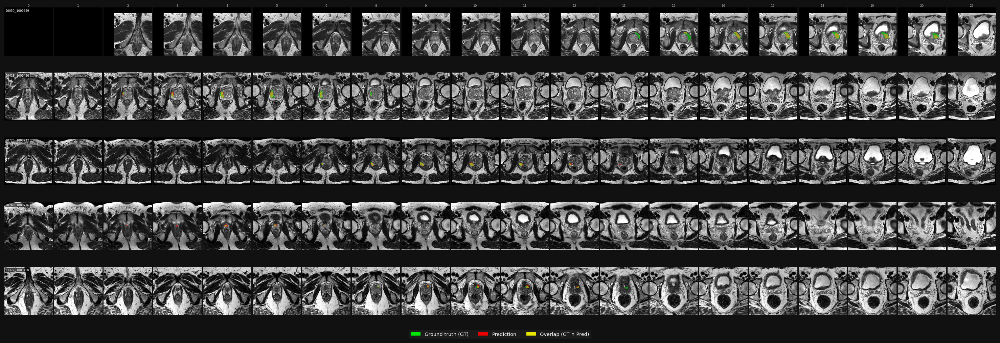

### Explainability (XAI)
- xai_summary: [`20260507_193114_deconver_tuned_a_10726_1000742_summary.json`](visualizations/xai/20260507_193114_deconver_tuned_a_10726_1000742_summary.json)
- generated_at: `2026-05-12T16:03:07`
- case_id: `10726_1000742`
- gradcam_target_layer: `encoder.blocks.3`

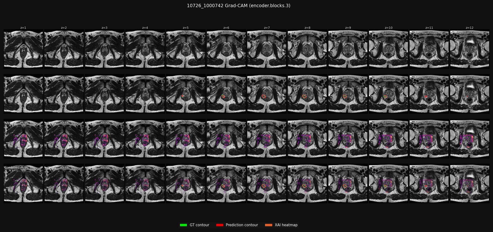

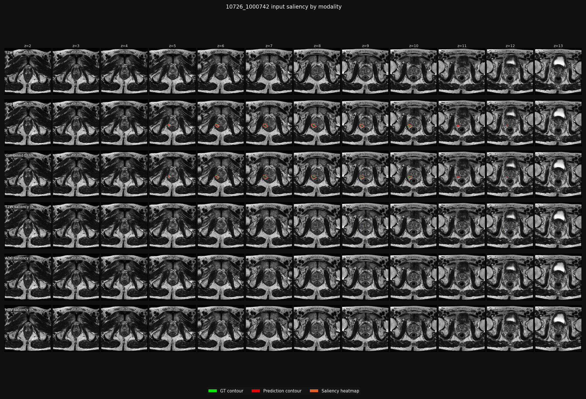

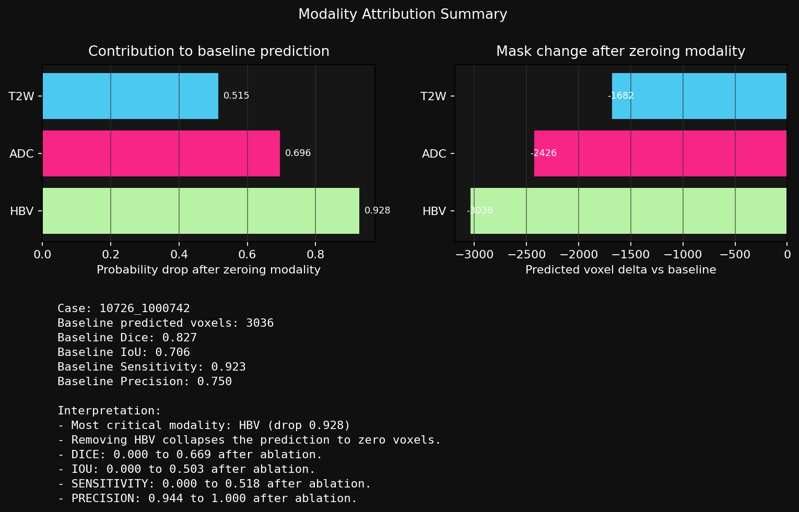

- saliency_channels: `adc, hbv, t2w`

#### Modality Ablation

| modality_zeroed | prob_drop | voxel_delta | dice | iou | sensitivity | precision |
| --- | --- | --- | --- | --- | --- | --- |
| t2w | 0.5150 | -1682 | 0.6693 | 0.5030 | 0.5185 | 0.9439 |
| adc | 0.6962 | -2426 | 0.3857 | 0.2389 | 0.2406 | 0.9721 |
| hbv | 0.9278 | -3036 | 0.0000 | 0.0000 | 0.0000 | 1.0000 |

### Evaluation
- checkpoint: `best.pt`
- test_cases: `10` (`5` positive, `5` negative)

| Metric | Value |
| --- | --- |
| dice | 0.6452 |
| iou | 0.4901 |
| sensitivity | 0.7320 |
| precision | 0.6810 |
| hd95 | 4.1868 |

### Training Validation Metrics

| Metric | Best | At Best Epoch | Last Val |
| --- | --- | --- | --- |
| composite_score | 0.4772 | 0.4772 | 0.4640 |
| dice | 0.4373 | 0.4304 | 0.4340 |
| iou | 0.3203 | 0.3107 | 0.3164 |
| sensitivity | 0.6095 | 0.5473 | 0.5090 |
| precision | 0.4974 | 0.4287 | 0.4637 |
| hd95 | 43.5947 | 63.1426 | 55.1105 |

### Config Highlights
- model: `deconver`
- features: `[32, 64, 128, 256]`
- loss: `tversky_bce` (alpha=0.3, beta=0.7, dice_weight=1.0, bce_weight=1.0, bce_pos_weight=10.0)
- patch_size: `[16, 128, 128]`
- target_spacing: `[3.0, 0.5, 0.5]`
- modalities: use_t2w=True, use_adc=True, use_hbv=True
- optimizer/schedule: lr=0.0001, weight_decay=1e-05, warmup_epochs=8
- train/val cadence: batch_size=2, epochs=140, val_every=2, val_start_epoch=1, val_compute_hd95_every=1
- best-checkpoint score weights: w_sensitivity=0.4, w_dice=0.6, w_hd95=0.0, hd95_scale=10.0
- early stopping: patience=50, min_delta=0.001
- runtime: use_amp=True, amp_dtype=bf16, use_compile=False
- encoder init: pretrained_encoder_checkpoint=, freeze_encoder_epochs=0
- parameters: total=10,478,659, trainable=10,478,659

### Warnings
- metadata.json config differs from config.yaml; using metadata.json (mismatched keys: sw_batch_size).

## 20260418_224246_deconver

- run_dir: `/outputs/runs/20260418_224246_deconver`
- experiment_name: `v3_multimodal`
- git_commit: `unknown`
- config_source: `metadata.json`
- start_time: `2026-04-18 22:45:55`
- end_time: `2026-04-19 06:05:15`
- duration: `7:19:20`
- epochs: stopped=139, configured=300, best=122
- early_stopped: `True`

### Visualization

### Explainability (XAI)
- xai_summary: [`20260418_224246_deconver_10726_1000742_summary.json`](visualizations/xai/20260418_224246_deconver_10726_1000742_summary.json)
- generated_at: `2026-05-12T16:15:26`
- case_id: `10726_1000742`
- gradcam_target_layer: `encoder.blocks.3`

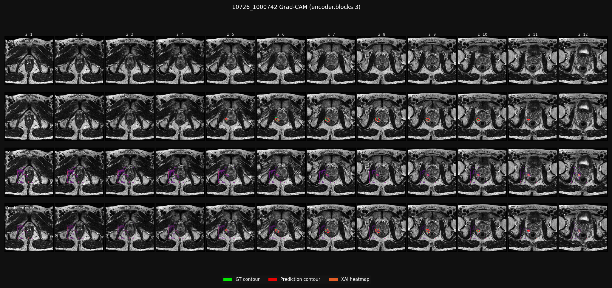

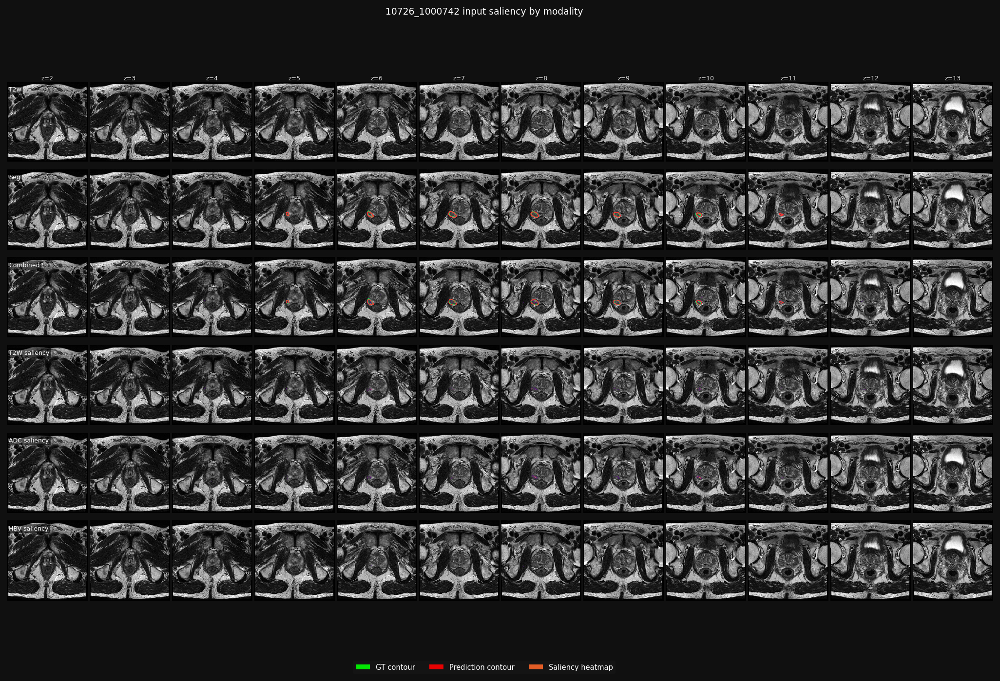

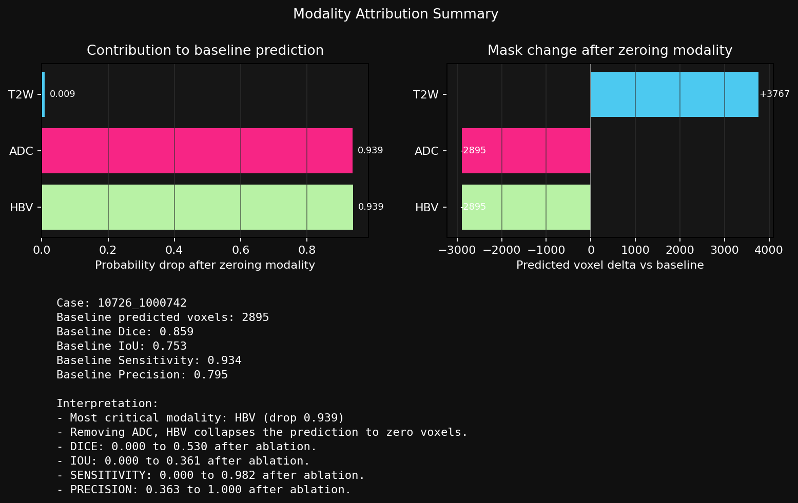

- saliency_channels: `adc, hbv, t2w`

#### Modality Ablation

| modality_zeroed | prob_drop | voxel_delta | dice | iou | sensitivity | precision |
| --- | --- | --- | --- | --- | --- | --- |
| t2w | 0.0092 | 3767 | 0.5303 | 0.3608 | 0.9817 | 0.3633 |
| adc | 0.9387 | -2895 | 0.0000 | 0.0000 | 0.0000 | 1.0000 |
| hbv | 0.9391 | -2895 | 0.0000 | 0.0000 | 0.0000 | 1.0000 |

### Evaluation
- checkpoint: `best.pt`
- test_cases: `10` (`5` positive, `5` negative)

| Metric | Value |
| --- | --- |
| dice | 0.6470 |
| iou | 0.4992 |
| sensitivity | 0.7732 |
| precision | 0.6525 |
| hd95 | 3.8062 |

### Training Validation Metrics

| Metric | Best | At Best Epoch | Last Val |
| --- | --- | --- | --- |
| composite_score | 0.4709 | 0.4709 | 0.4465 |
| dice | 0.4067 | 0.4067 | 0.3602 |
| iou | 0.2859 | 0.2859 | 0.2452 |
| sensitivity | 0.6567 | 0.5672 | 0.5760 |
| precision | 0.4451 | 0.3786 | 0.3142 |
| hd95 | 58.3092 | 82.1918 | 124.8797 |

### Config Highlights
- model: `deconver`
- features: `[32, 64, 128, 256]`
- loss: `tversky_bce` (alpha=0.3, beta=0.7, dice_weight=1.0, bce_weight=1.0, bce_pos_weight=10.0)
- patch_size: `[16, 128, 128]`
- target_spacing: `[3.0, 0.5, 0.5]`
- modalities: use_t2w=True, use_adc=True, use_hbv=True
- optimizer/schedule: lr=0.0004, weight_decay=1e-05, warmup_epochs=10
- train/val cadence: batch_size=12, epochs=300, val_every=2, val_start_epoch=100, val_compute_hd95_every=1
- best-checkpoint score weights: w_sensitivity=0.4, w_dice=0.6, w_hd95=0.0, hd95_scale=10.0
- early stopping: patience=50, min_delta=0.001
- runtime: use_amp=True, amp_dtype=bf16, use_compile=False
- encoder init: pretrained_encoder_checkpoint=n/a, freeze_encoder_epochs=n/a
- parameters: total=10,478,659, trainable=10,478,659

### Warnings
- metadata.json config differs from config.yaml; using metadata.json (mismatched keys: postprocess_connectivity, postprocess_enabled, postprocess_min_component_volume_mm3, pred_threshold, sw_batch_size).

## 20260514_153746_deconver_tuned_a

- run_dir: `/outputs/runs/20260514_153746_deconver_tuned_a`
- experiment_name: `deconver_tuned_a`
- git_commit: `unknown`
- config_source: `metadata.json`
- start_time: `2026-05-14 15:38:26`
- end_time: `2026-05-14 15:56:50`
- duration: `0:18:24`
- epochs: stopped=25, configured=25, best=10
- early_stopped: `False`

### Visualization

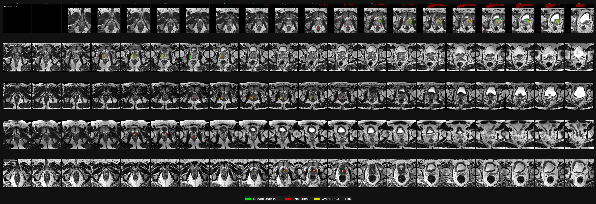

### Explainability (XAI)
- xai_summary: `n/a`

### Evaluation
- checkpoint: `best.pt`
- test_cases: `10` (`5` positive, `5` negative)

| Metric | Value |
| --- | --- |
| dice | 0.5118 |
| iou | 0.3690 |
| sensitivity | 0.9002 |
| precision | 0.3873 |
| hd95 | 115.9511 |

### Training Validation Metrics

| Metric | Best | At Best Epoch | Last Val |
| --- | --- | --- | --- |
| composite_score | 0.4646 | 0.4646 | 0.3874 |
| dice | 0.4728 | 0.4686 | 0.4151 |
| iou | 0.3419 | 0.3419 | 0.2882 |
| sensitivity | 0.4586 | 0.4586 | 0.3458 |
| precision | 0.6755 | 0.5231 | 0.6152 |
| hd95 | 19.9069 | 37.8259 | 29.8171 |

### Config Highlights
- model: `deconver`
- features: `[32, 64, 128, 256]`
- loss: `tversky_bce` (alpha=0.3, beta=0.7, dice_weight=1.0, bce_weight=1.0, bce_pos_weight=10.0)
- patch_size: `[16, 128, 128]`
- target_spacing: `[3.0, 0.5, 0.5]`
- modalities: use_t2w=True, use_adc=True, use_hbv=True
- optimizer/schedule: lr=0.0001, weight_decay=1e-05, warmup_epochs=8
- train/val cadence: batch_size=2, epochs=25, val_every=2, val_start_epoch=1, val_compute_hd95_every=1
- best-checkpoint score weights: w_sensitivity=0.4, w_dice=0.6, w_hd95=0.0, hd95_scale=10.0
- early stopping: patience=50, min_delta=0.001
- runtime: use_amp=True, amp_dtype=bf16, use_compile=False
- encoder init: pretrained_encoder_checkpoint=/outputs/pretrain_runs/20260505_215426_ssl_pretrain_deconver_mae/checkpoints/best.pt, freeze_encoder_epochs=0
- parameters: total=10,478,659, trainable=10,478,659

## 20260427_221309_unet3d

- run_dir: `/outputs/runs/20260427_221309_unet3d`
- experiment_name: `unet3d`
- git_commit: `unknown`
- config_source: `metadata.json`
- start_time: `2026-04-27 22:18:00`
- end_time: `2026-04-28 11:43:46`
- duration: `13:25:46`
- epochs: stopped=300, configured=300, best=276
- early_stopped: `False`

### Visualization

### Explainability (XAI)
- xai_summary: [`20260427_221309_unet3d_10726_1000742_summary.json`](visualizations/xai/20260427_221309_unet3d_10726_1000742_summary.json)
- generated_at: `2026-05-12T16:04:09`
- case_id: `10726_1000742`
- gradcam_target_layer: `bottleneck`

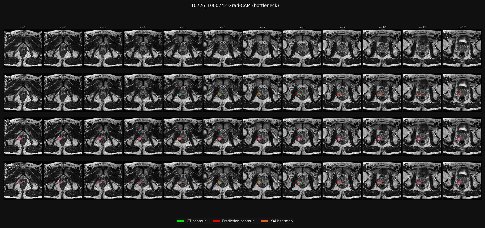

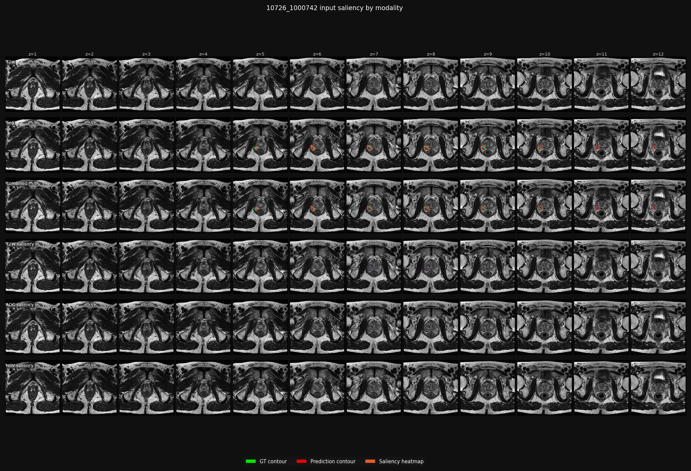

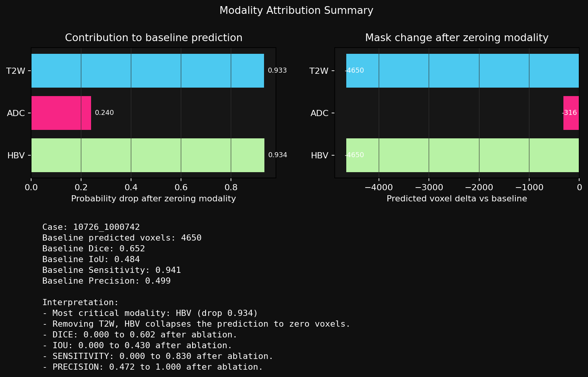

- saliency_channels: `adc, hbv, t2w`

#### Modality Ablation

| modality_zeroed | prob_drop | voxel_delta | dice | iou | sensitivity | precision |
| --- | --- | --- | --- | --- | --- | --- |
| t2w | 0.9332 | -4650 | 0.0000 | 0.0000 | 0.0000 | 1.0000 |
| adc | 0.2397 | -316 | 0.6019 | 0.4305 | 0.8300 | 0.4721 |
| hbv | 0.9337 | -4650 | 0.0000 | 0.0000 | 0.0000 | 1.0000 |

### Evaluation
- checkpoint: `best.pt`
- test_cases: `10` (`5` positive, `5` negative)

| Metric | Value |
| --- | --- |
| dice | 0.6332 |
| iou | 0.4820 |
| sensitivity | 0.8329 |
| precision | 0.5876 |
| hd95 | 4.4875 |

### Training Validation Metrics

| Metric | Best | At Best Epoch | Last Val |
| --- | --- | --- | --- |
| composite_score | 0.4409 | 0.4409 | 0.4317 |
| dice | 0.4152 | 0.4133 | 0.4092 |
| iou | 0.3042 | 0.3016 | 0.2991 |
| sensitivity | 0.5181 | 0.5054 | 0.4840 |
| precision | 0.5335 | 0.4294 | 0.4500 |
| hd95 | 39.3815 | 55.2711 | 64.8517 |

### Config Highlights
- model: `attention_unet3d`
- features: `[64, 128, 256, 512]`
- loss: `tversky_bce` (alpha=0.3, beta=0.7, dice_weight=1.0, bce_weight=1.0, bce_pos_weight=10.0)
- patch_size: `[16, 128, 128]`
- target_spacing: `[3.0, 0.5, 0.5]`
- modalities: use_t2w=True, use_adc=True, use_hbv=True
- optimizer/schedule: lr=0.0004, weight_decay=1e-05, warmup_epochs=10
- train/val cadence: batch_size=8, epochs=300, val_every=2, val_start_epoch=50, val_compute_hd95_every=1
- best-checkpoint score weights: w_sensitivity=0.3, w_dice=0.7, w_hd95=0.0, hd95_scale=10.0
- early stopping: patience=50, min_delta=0.001
- runtime: use_amp=True, amp_dtype=fp16, use_compile=False
- encoder init: pretrained_encoder_checkpoint=./outputs/pretrain_runs/20260426_160028_ssl_pretrain_mae/checkpoints/best.pt, freeze_encoder_epochs=0
- parameters: total=90,654,448, trainable=90,654,448

### Warnings
- metadata.json config differs from config.yaml; using metadata.json (mismatched keys: sw_batch_size).

## 20260513_105631_deconver_multitask_a

- run_dir: `/outputs/runs/20260513_105631_deconver_multitask_a`
- experiment_name: `deconver_multitask_a`
- git_commit: `unknown`
- config_source: `metadata.json`
- start_time: `2026-05-13 11:01:33`
- end_time: `2026-05-13 21:01:30`
- duration: `9:59:57`
- epochs: stopped=26, configured=140, best=4
- early_stopped: `True`

### Visualization

### Explainability (XAI)
- xai_summary: `n/a`

### Evaluation
- checkpoint: `best.pt`
- test_cases: `10` (`5` positive, `5` negative)

| Metric | Value |
| --- | --- |
| dice | 0.6076 |
| iou | 0.4557 |
| sensitivity | 0.6686 |
| precision | 0.6985 |
| hd95 | 4.7500 |

### Training Validation Metrics

| Metric | Best | At Best Epoch | Last Val |
| --- | --- | --- | --- |
| composite_score | 0.4377 | 0.4377 | 0.4094 |
| dice | 0.4313 | 0.4313 | 0.4068 |
| iou | 0.3118 | 0.3118 | 0.2945 |
| sensitivity | 0.5606 | 0.5317 | 0.4853 |
| precision | 0.5256 | 0.4336 | 0.4319 |
| hd95 | 45.8476 | 61.9843 | 63.4659 |

### Config Highlights
- model: `deconver_multitask`
- features: `[32, 64, 128, 256]`
- loss: `tversky_bce` (alpha=0.3, beta=0.7, dice_weight=1.0, bce_weight=1.0, bce_pos_weight=10.0)
- patch_size: `[16, 128, 128]`
- target_spacing: `[3.0, 0.5, 0.5]`
- modalities: use_t2w=True, use_adc=True, use_hbv=True
- optimizer/schedule: lr=0.0001, weight_decay=1e-05, warmup_epochs=8
- train/val cadence: batch_size=2, epochs=140, val_every=2, val_start_epoch=1, val_compute_hd95_every=1
- best-checkpoint score weights: w_sensitivity=0.35, w_dice=0.45, w_hd95=0.2, hd95_scale=25.0
- early stopping: patience=50, min_delta=0.001
- runtime: use_amp=True, amp_dtype=bf16, use_compile=False
- encoder init: pretrained_encoder_checkpoint=/outputs/pretrain_runs/20260505_215426_ssl_pretrain_deconver_mae/checkpoints/best.pt, freeze_encoder_epochs=0
- parameters: total=10,479,172, trainable=10,479,172

### Warnings
- Using centralized eval PNG from visualizations directory: 20260513_105631_deconver_multitask_a_eval_visualization.png

## 20260416_112700_v3_multimodal

- run_dir: `/outputs/runs/20260416_112700_v3_multimodal`
- experiment_name: `v3_multimodal`
- git_commit: `unknown`
- config_source: `metadata.json`
- start_time: `2026-04-16 11:31:35`
- end_time: `2026-04-16 18:57:56`
- duration: `7:26:21`
- epochs: stopped=170, configured=300, best=146
- early_stopped: `True`

### Visualization

### Explainability (XAI)
- xai_summary: [`20260416_112700_v3_multimodal_10726_1000742_summary.json`](visualizations/xai/20260416_112700_v3_multimodal_10726_1000742_summary.json)
- generated_at: `2026-05-12T16:16:31`
- case_id: `10726_1000742`
- gradcam_target_layer: `bottleneck`

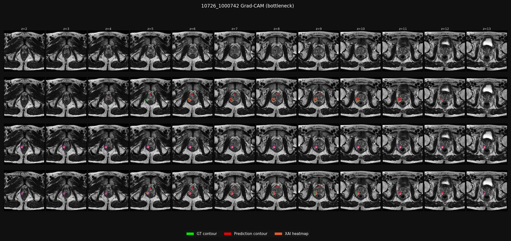

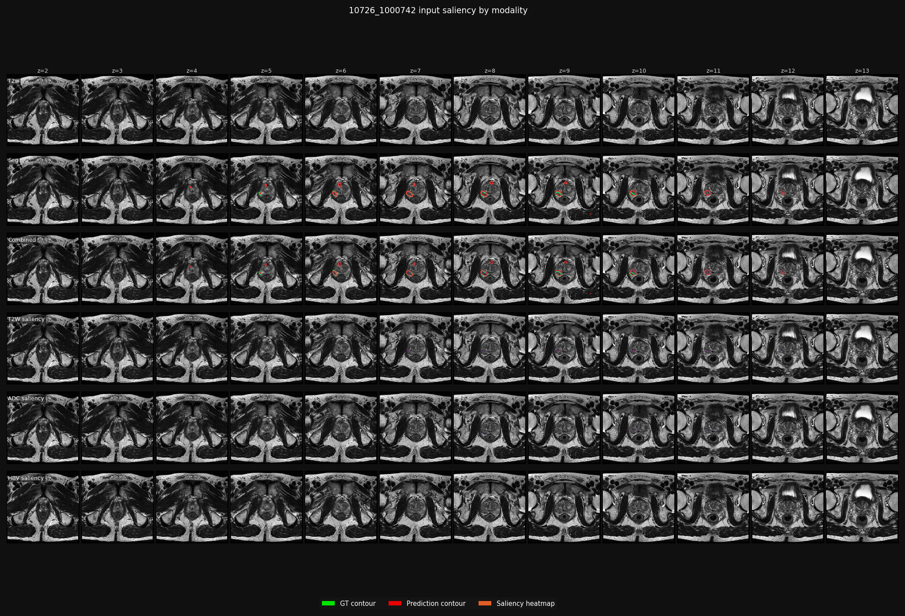

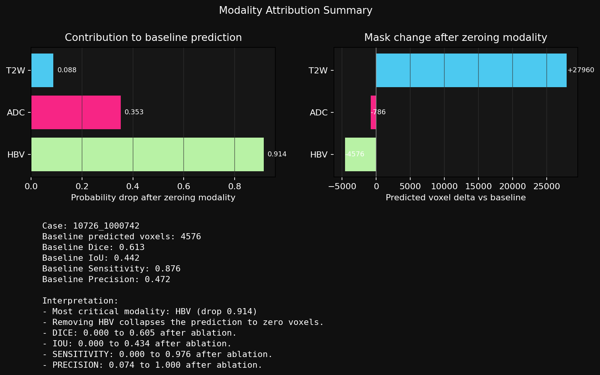

- saliency_channels: `adc, hbv, t2w`

#### Modality Ablation

| modality_zeroed | prob_drop | voxel_delta | dice | iou | sensitivity | precision |
| --- | --- | --- | --- | --- | --- | --- |
| t2w | 0.0875 | 27960 | 0.1375 | 0.0738 | 0.9765 | 0.0740 |
| adc | 0.3527 | -786 | 0.6053 | 0.4340 | 0.7680 | 0.4995 |
| hbv | 0.9144 | -4576 | 0.0000 | 0.0000 | 0.0000 | 1.0000 |

### Evaluation
- checkpoint: `best.pt`
- test_cases: `10` (`5` positive, `5` negative)

| Metric | Value |
| --- | --- |
| dice | 0.5914 |
| iou | 0.4425 |
| sensitivity | 0.6959 |
| precision | 0.5456 |
| hd95 | 70.5337 |

### Training Validation Metrics

| Metric | Best | At Best Epoch | Last Val |
| --- | --- | --- | --- |
| composite_score | 0.4323 | 0.4323 | 0.3969 |
| dice | 0.3620 | 0.3481 | 0.3464 |
| iou | 0.2547 | 0.2405 | 0.2393 |
| sensitivity | 0.6184 | 0.5585 | 0.4727 |
| precision | 0.4602 | 0.3052 | 0.3332 |
| hd95 | 55.2121 | 83.8742 | 119.6348 |

### Config Highlights
- model: `attention_unet3d`
- features: `[32, 64, 128, 256]`
- loss: `tversky_bce` (alpha=0.3, beta=0.7, dice_weight=1.0, bce_weight=1.0, bce_pos_weight=10.0)
- patch_size: `[20, 128, 128]`
- target_spacing: `[3.0, 0.5, 0.5]`
- modalities: use_t2w=True, use_adc=True, use_hbv=True
- optimizer/schedule: lr=0.0004, weight_decay=1e-05, warmup_epochs=10
- train/val cadence: batch_size=16, epochs=300, val_every=2, val_start_epoch=n/a, val_compute_hd95_every=1
- best-checkpoint score weights: w_sensitivity=0.4, w_dice=0.6, w_hd95=0.0, hd95_scale=10.0
- early stopping: patience=50, min_delta=0.001
- runtime: use_amp=True, amp_dtype=fp16, use_compile=False
- encoder init: pretrained_encoder_checkpoint=n/a, freeze_encoder_epochs=n/a
- parameters: total=22,669,184, trainable=22,669,184

### Warnings
- metadata.json config differs from config.yaml; using metadata.json (mismatched keys: sw_batch_size).

## 20260507_205845_fct_default

- run_dir: `/outputs/runs/20260507_205845_fct_default`
- experiment_name: `fct_default`
- git_commit: `unknown`
- config_source: `metadata.json`
- start_time: `2026-05-07 21:04:20`
- end_time: `2026-05-09 17:10:25`
- duration: `44:06:05`
- epochs: stopped=300, configured=300, best=268
- early_stopped: `False`

### Visualization

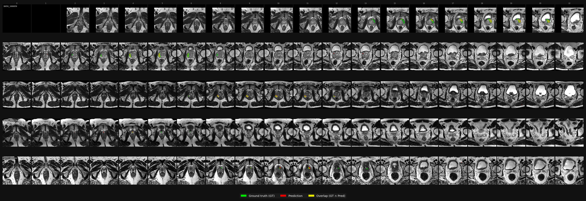

### Explainability (XAI)
- xai_summary: [`20260507_205845_fct_default_10726_1000742_summary.json`](visualizations/xai/20260507_205845_fct_default_10726_1000742_summary.json)
- generated_at: `2026-05-12T16:02:41`
- case_id: `10726_1000742`
- gradcam_target_layer: `bottleneck`

#### Method Errors

| method | error |
| --- | --- |
| gradcam | RuntimeError: Target layer 'bottleneck' did not produce a 5D activation/gradient pair. |

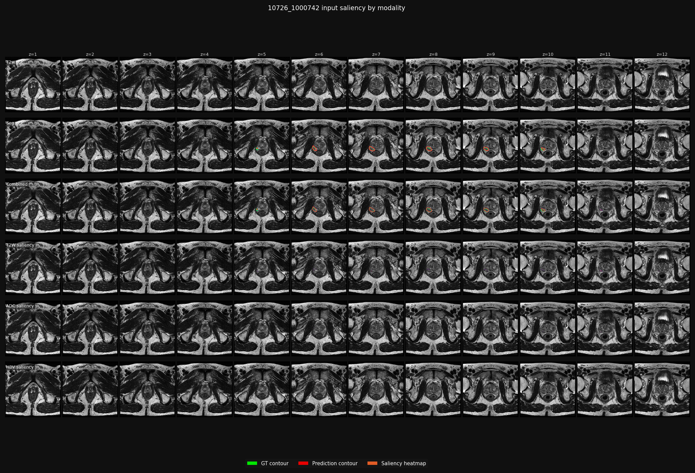

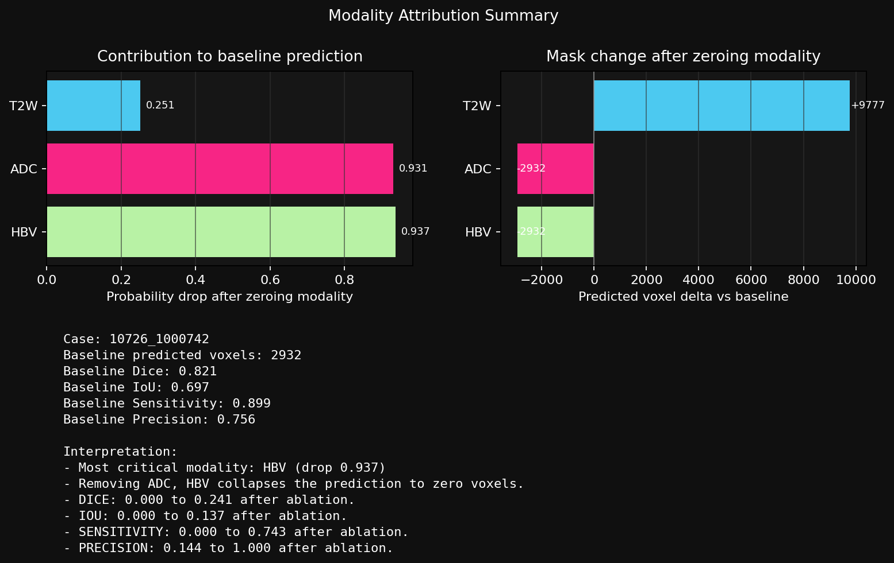

- saliency_channels: `adc, hbv, t2w`

#### Modality Ablation

| modality_zeroed | prob_drop | voxel_delta | dice | iou | sensitivity | precision |
| --- | --- | --- | --- | --- | --- | --- |
| t2w | 0.2510 | 9777 | 0.2413 | 0.1372 | 0.7428 | 0.1441 |
| adc | 0.9314 | -2932 | 0.0000 | 0.0000 | 0.0000 | 1.0000 |
| hbv | 0.9366 | -2932 | 0.0000 | 0.0000 | 0.0000 | 1.0000 |

### Evaluation
- checkpoint: `best.pt`
- test_cases: `10` (`5` positive, `5` negative)

| Metric | Value |
| --- | --- |
| dice | 0.5780 |
| iou | 0.4217 |
| sensitivity | 0.5308 |
| precision | 0.6968 |
| hd95 | 4.4900 |

### Training Validation Metrics

| Metric | Best | At Best Epoch | Last Val |
| --- | --- | --- | --- |
| composite_score | 0.4311 | 0.4311 | 0.4128 |
| dice | 0.4149 | 0.4149 | 0.4047 |
| iou | 0.2979 | 0.2979 | 0.2915 |
| sensitivity | 0.5023 | 0.4688 | 0.4316 |
| precision | 0.7547 | 0.4972 | 0.5147 |
| hd95 | 51.4333 | 74.2021 | 67.5139 |

### Config Highlights
- model: `fct`
- features: `[32, 64, 128, 256]`
- loss: `tversky_bce` (alpha=0.3, beta=0.7, dice_weight=1.0, bce_weight=1.0, bce_pos_weight=10.0)
- patch_size: `[16, 128, 128]`
- target_spacing: `[3.0, 0.5, 0.5]`
- modalities: use_t2w=True, use_adc=True, use_hbv=True
- optimizer/schedule: lr=0.0004, weight_decay=1e-05, warmup_epochs=10
- train/val cadence: batch_size=6, epochs=300, val_every=2, val_start_epoch=0, val_compute_hd95_every=1
- best-checkpoint score weights: w_sensitivity=0.3, w_dice=0.7, w_hd95=0.0, hd95_scale=10.0
- early stopping: patience=50, min_delta=0.001
- runtime: use_amp=True, amp_dtype=fp16, use_compile=False
- encoder init: pretrained_encoder_checkpoint=, freeze_encoder_epochs=0
- parameters: total=21,245,796, trainable=21,245,796

### Warnings
- metadata.json config differs from config.yaml; using metadata.json (mismatched keys: sw_batch_size, val_min_sw_batch_siz, val_min_sw_batch_size).

## 20260416_193800_v3_multimodal

- run_dir: `/outputs/runs/20260416_193800_v3_multimodal`
- experiment_name: `v3_multimodal`
- git_commit: `unknown`
- config_source: `metadata.json`
- start_time: `2026-04-16 19:42:57`
- end_time: `2026-04-17 07:51:54`
- duration: `12:08:57`
- epochs: stopped=300, configured=300, best=206
- early_stopped: `False`

### Visualization

### Explainability (XAI)
- xai_summary: [`20260416_193800_v3_multimodal_10726_1000742_summary.json`](visualizations/xai/20260416_193800_v3_multimodal_10726_1000742_summary.json)
- generated_at: `2026-05-12T16:15:59`
- case_id: `10726_1000742`
- gradcam_target_layer: `bottleneck`

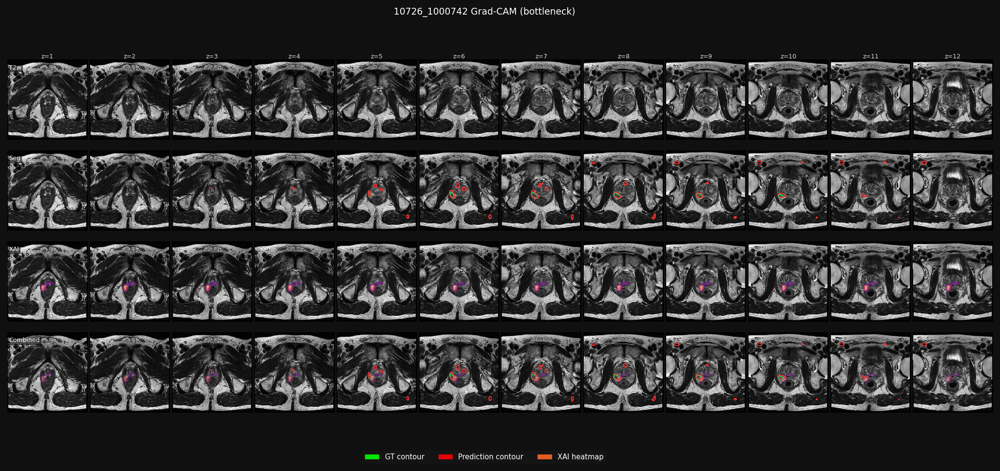

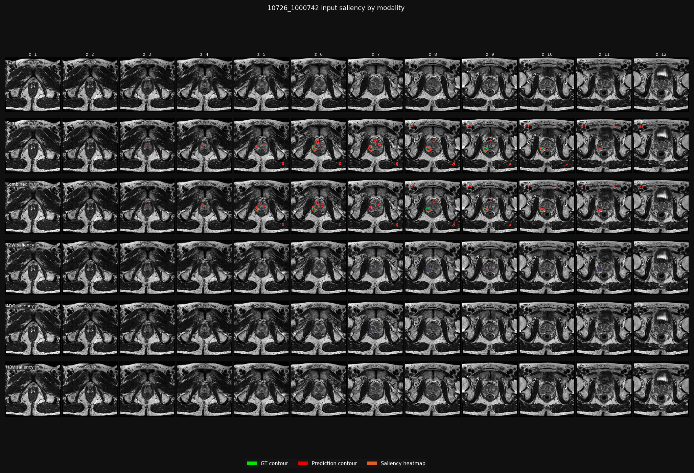

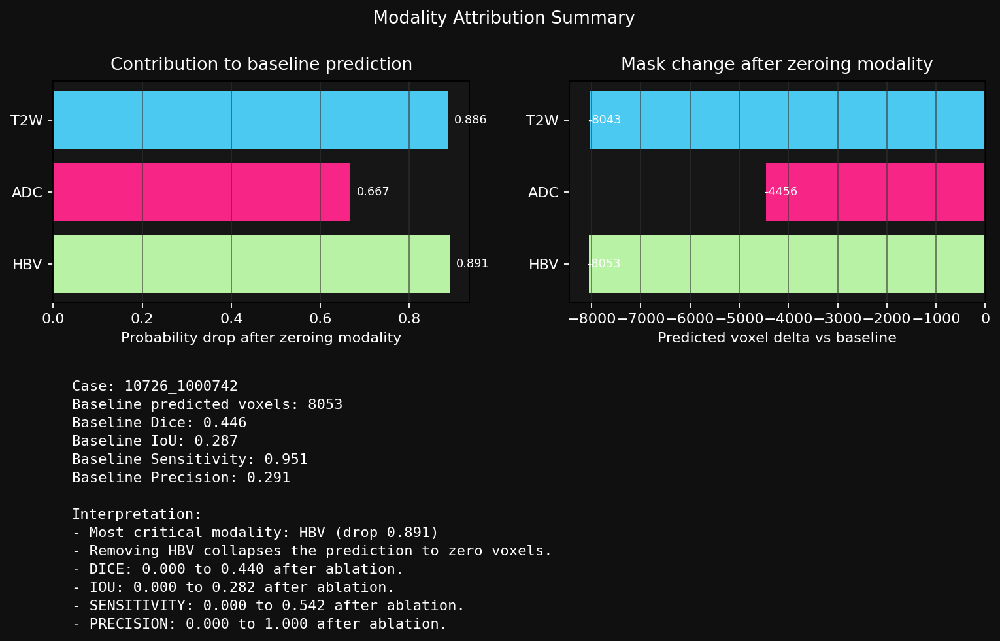

- saliency_channels: `adc, hbv, t2w`

#### Modality Ablation

| modality_zeroed | prob_drop | voxel_delta | dice | iou | sensitivity | precision |
| --- | --- | --- | --- | --- | --- | --- |
| t2w | 0.8861 | -8043 | 0.0000 | 0.0000 | 0.0000 | 0.0000 |
| adc | 0.6668 | -4456 | 0.4404 | 0.2824 | 0.5416 | 0.3711 |
| hbv | 0.8906 | -8053 | 0.0000 | 0.0000 | 0.0000 | 1.0000 |

### Evaluation
- checkpoint: `best.pt`
- test_cases: `10` (`5` positive, `5` negative)

| Metric | Value |
| --- | --- |
| dice | 0.4731 |
| iou | 0.3210 |
| sensitivity | 0.8639 |
| precision | 0.3366 |
| hd95 | 146.2934 |

### Training Validation Metrics

| Metric | Best | At Best Epoch | Last Val |
| --- | --- | --- | --- |
| composite_score | 0.4166 | 0.4166 | 0.4017 |
| dice | 0.3732 | 0.3496 | 0.3688 |
| iou | 0.2650 | 0.2418 | 0.2612 |
| sensitivity | 0.5171 | 0.5171 | 0.4512 |
| precision | 0.4833 | 0.3221 | 0.4064 |
| hd95 | 79.1391 | 129.0608 | 88.7216 |

### Config Highlights
- model: `attention_unet3d`
- features: `[32, 64, 128, 256]`
- loss: `tversky_bce` (alpha=0.3, beta=0.7, dice_weight=1.0, bce_weight=1.0, bce_pos_weight=10.0)
- patch_size: `[20, 128, 128]`
- target_spacing: `[3.0, 0.5, 0.5]`
- modalities: use_t2w=True, use_adc=True, use_hbv=True
- optimizer/schedule: lr=0.0004, weight_decay=1e-05, warmup_epochs=10
- train/val cadence: batch_size=16, epochs=300, val_every=2, val_start_epoch=100, val_compute_hd95_every=1
- best-checkpoint score weights: w_sensitivity=0.4, w_dice=0.6, w_hd95=0.0, hd95_scale=10.0
- early stopping: patience=50, min_delta=0.001
- runtime: use_amp=True, amp_dtype=fp16, use_compile=False
- encoder init: pretrained_encoder_checkpoint=n/a, freeze_encoder_epochs=n/a
- parameters: total=22,669,184, trainable=22,669,184

### Warnings
- metadata.json config differs from config.yaml; using metadata.json (mismatched keys: sw_batch_size).

## 20260420_212454_deconver

- run_dir: `/outputs/runs/20260420_212454_deconver`
- experiment_name: `deconver`
- git_commit: `unknown`
- config_source: `metadata.json`
- start_time: `2026-04-20 21:29:37`
- end_time: `2026-04-21 07:01:06`
- duration: `9:31:29`
- epochs: stopped=210, configured=300, best=145
- early_stopped: `True`

### Visualization

### Explainability (XAI)
- xai_summary: [`20260420_212454_deconver_10726_1000742_summary.json`](visualizations/xai/20260420_212454_deconver_10726_1000742_summary.json)
- generated_at: `2026-05-12T16:13:15`
- case_id: `10726_1000742`
- gradcam_target_layer: `encoder.blocks.3`

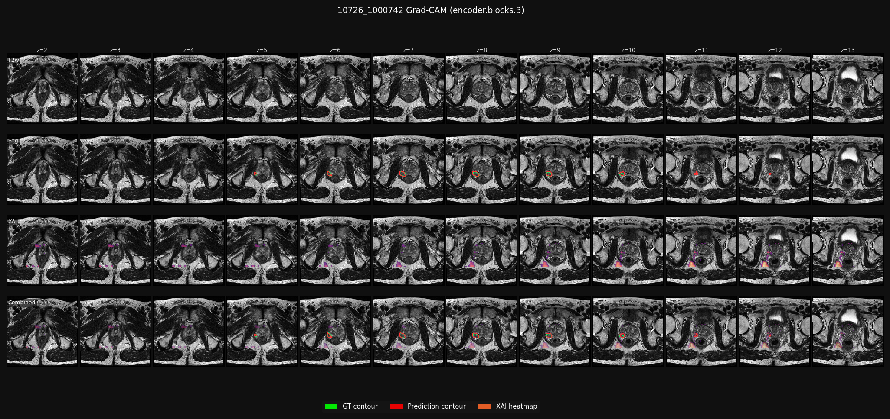

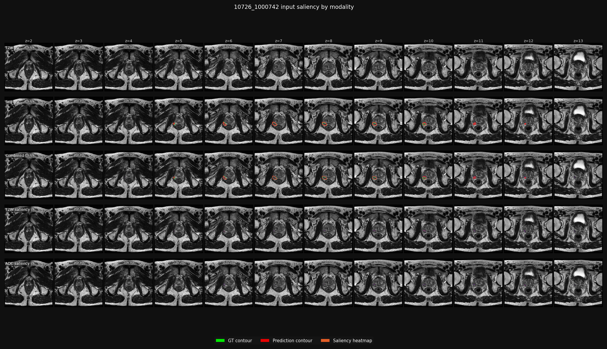

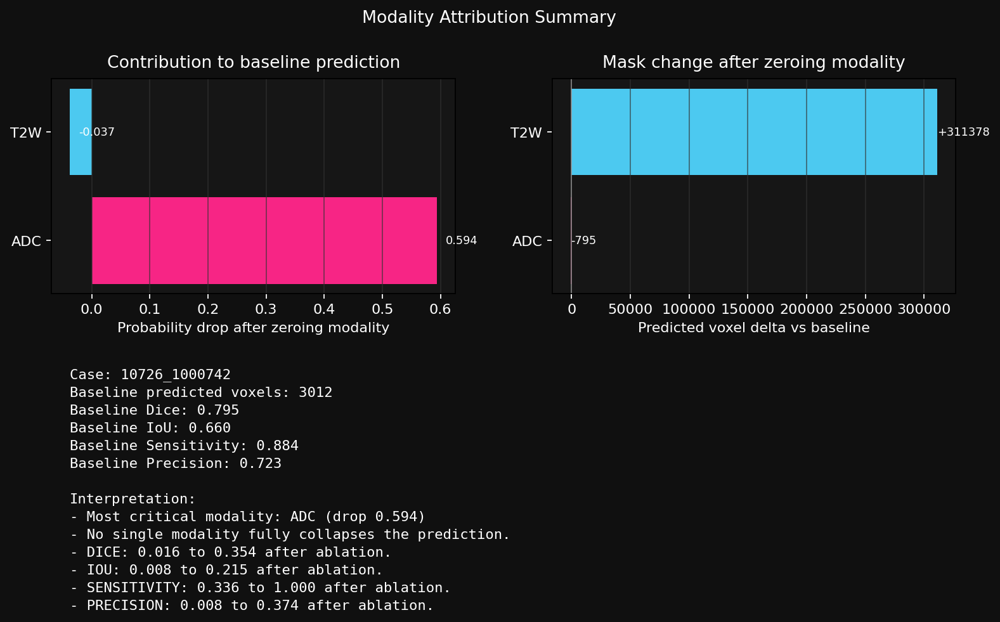

- saliency_channels: `adc, t2w`

#### Modality Ablation

| modality_zeroed | prob_drop | voxel_delta | dice | iou | sensitivity | precision |
| --- | --- | --- | --- | --- | --- | --- |
| t2w | -0.0373 | 311378 | 0.0156 | 0.0078 | 1.0000 | 0.0078 |
| adc | 0.5941 | -795 | 0.3541 | 0.2152 | 0.3363 | 0.3739 |

### Evaluation
- checkpoint: `best.pt`
- test_cases: `10` (`5` positive, `5` negative)

| Metric | Value |
| --- | --- |
| dice | 0.6143 |
| iou | 0.4644 |
| sensitivity | 0.8629 |
| precision | 0.5184 |
| hd95 | 12.8735 |

### Training Validation Metrics

| Metric | Best | At Best Epoch | Last Val |
| --- | --- | --- | --- |
| composite_score | 0.3970 | 0.3970 | 0.3775 |
| dice | 0.3458 | 0.2953 | 0.3458 |
| iou | 0.2420 | 0.1970 | 0.2420 |
| sensitivity | 0.5495 | 0.5495 | 0.4250 |
| precision | 0.4670 | 0.2501 | 0.3751 |
| hd95 | 54.6309 | 130.5263 | 96.8266 |

### Config Highlights
- model: `deconver`
- features: `[32, 64, 128, 256]`
- loss: `tversky_bce` (alpha=0.3, beta=0.7, dice_weight=1.0, bce_weight=1.0, bce_pos_weight=10.0)
- patch_size: `[16, 128, 128]`
- target_spacing: `[3.0, 0.5, 0.5]`
- modalities: use_t2w=True, use_adc=True, use_hbv=False
- optimizer/schedule: lr=0.0004, weight_decay=1e-05, warmup_epochs=10
- train/val cadence: batch_size=12, epochs=300, val_every=5, val_start_epoch=100, val_compute_hd95_every=1
- best-checkpoint score weights: w_sensitivity=0.4, w_dice=0.6, w_hd95=0.0, hd95_scale=10.0
- early stopping: patience=50, min_delta=0.001
- runtime: use_amp=True, amp_dtype=bf16, use_compile=False
- encoder init: pretrained_encoder_checkpoint=n/a, freeze_encoder_epochs=n/a
- parameters: total=10,476,931, trainable=10,476,931

### Warnings
- metadata.json config differs from config.yaml; using metadata.json (mismatched keys: postprocess_connectivity, postprocess_enabled, postprocess_min_component_volume_mm3, pred_threshold, sw_batch_size).

## 20260426_104802_v3_multimodal

- run_dir: `/outputs/runs/20260426_104802_v3_multimodal`
- experiment_name: `v3_multimodal`
- git_commit: `unknown`
- config_source: `metadata.json`
- start_time: `2026-04-26 10:52:44`
- end_time: `2026-04-26 13:02:52`
- duration: `2:10:08`
- epochs: stopped=150, configured=300, best=118
- early_stopped: `True`

### Visualization

### Explainability (XAI)
- xai_summary: [`20260426_104802_v3_multimodal_10726_1000742_summary.json`](visualizations/xai/20260426_104802_v3_multimodal_10726_1000742_summary.json)
- generated_at: `2026-05-12T16:11:11`
- case_id: `10726_1000742`
- gradcam_target_layer: `bottleneck`

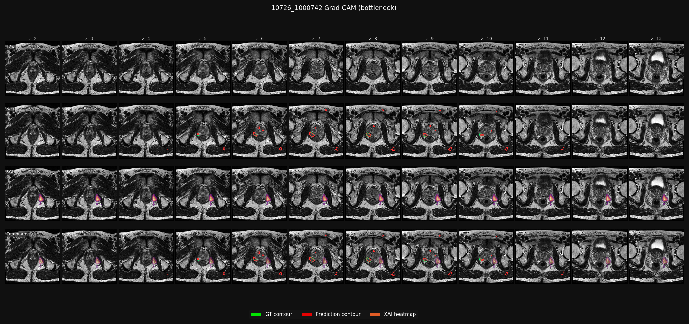

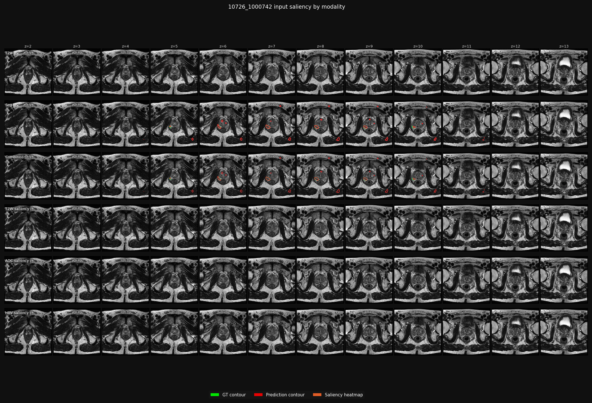

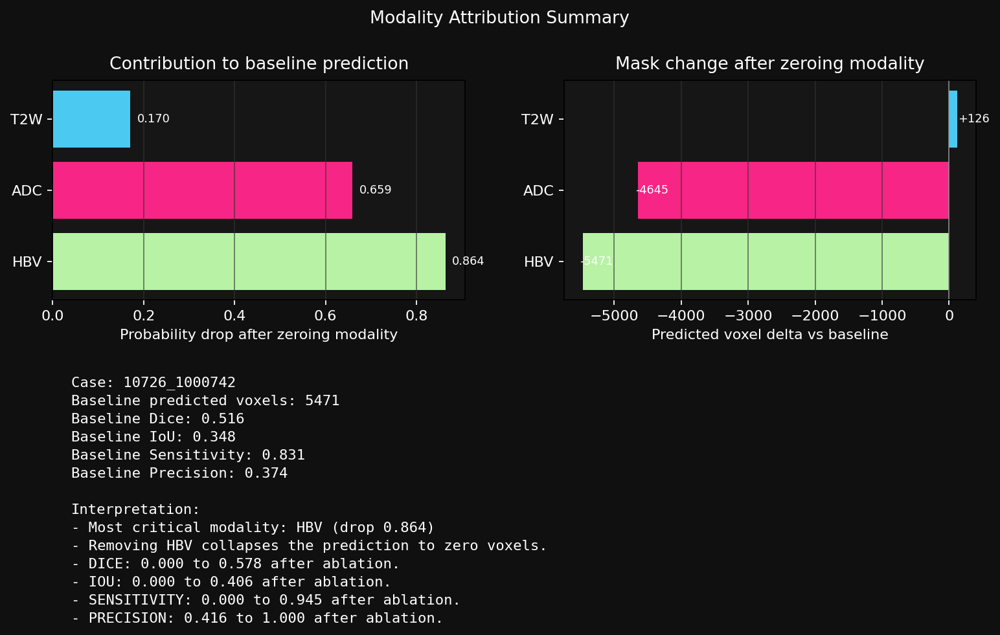

- saliency_channels: `adc, hbv, t2w`

#### Modality Ablation

| modality_zeroed | prob_drop | voxel_delta | dice | iou | sensitivity | precision |
| --- | --- | --- | --- | --- | --- | --- |
| t2w | 0.1701 | 126 | 0.5778 | 0.4062 | 0.9448 | 0.4161 |
| adc | 0.6593 | -4645 | 0.3950 | 0.2461 | 0.2637 | 0.7869 |
| hbv | 0.8638 | -5471 | 0.0000 | 0.0000 | 0.0000 | 1.0000 |

### Evaluation
- checkpoint: `best.pt`
- test_cases: `10` (`5` positive, `5` negative)

| Metric | Value |
| --- | --- |
| dice | 0.4864 |
| iou | 0.3297 |
| sensitivity | 0.7604 |
| precision | 0.3875 |
| hd95 | 130.5286 |

### Training Validation Metrics

| Metric | Best | At Best Epoch | Last Val |
| --- | --- | --- | --- |
| composite_score | 0.3718 | 0.3718 | 0.3024 |
| dice | 0.3108 | 0.3084 | 0.2831 |
| iou | 0.2137 | 0.2099 | 0.1982 |
| sensitivity | 0.4736 | 0.4669 | 0.3314 |
| precision | 0.4607 | 0.2926 | 0.3636 |
| hd95 | 105.9377 | 137.1890 | 148.0802 |

### Config Highlights
- model: `attention_unet3d`
- features: `[32, 64, 128, 256]`
- loss: `tversky_bce` (alpha=0.3, beta=0.7, dice_weight=1.0, bce_weight=1.0, bce_pos_weight=10.0)
- patch_size: `[16, 128, 128]`
- target_spacing: `[3.0, 0.5, 0.5]`
- modalities: use_t2w=True, use_adc=True, use_hbv=True
- optimizer/schedule: lr=0.0004, weight_decay=1e-05, warmup_epochs=10
- train/val cadence: batch_size=16, epochs=300, val_every=2, val_start_epoch=100, val_compute_hd95_every=1
- best-checkpoint score weights: w_sensitivity=0.4, w_dice=0.6, w_hd95=0.0, hd95_scale=10.0
- early stopping: patience=50, min_delta=0.001
- runtime: use_amp=True, amp_dtype=fp16, use_compile=False
- encoder init: pretrained_encoder_checkpoint=, freeze_encoder_epochs=0
- parameters: total=22,669,184, trainable=22,669,184

### Warnings
- metadata.json config differs from config.yaml; using metadata.json (mismatched keys: sw_batch_size).
- Multiple orbit GIFs found under /workspace/visualizations; using 20260426_104802_v3_multimodal_10726_1000742_orbit.gif.
