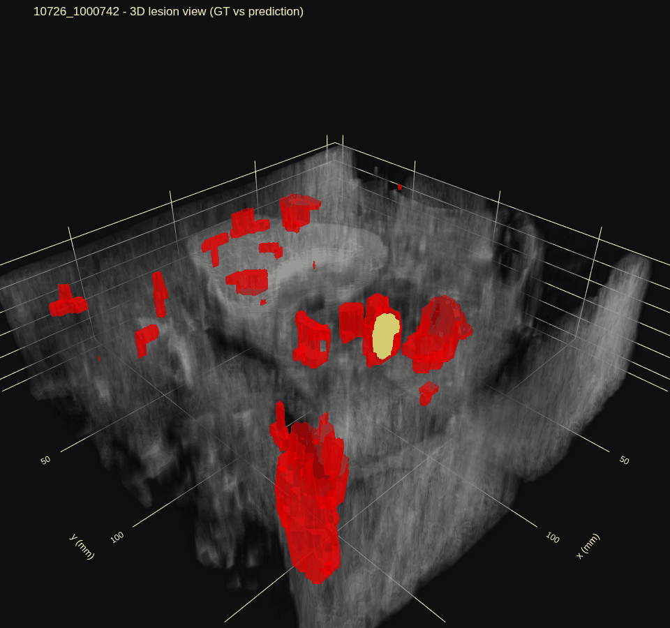
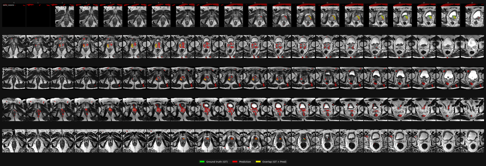
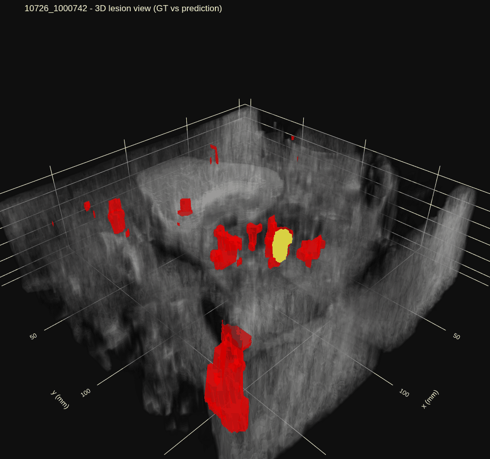
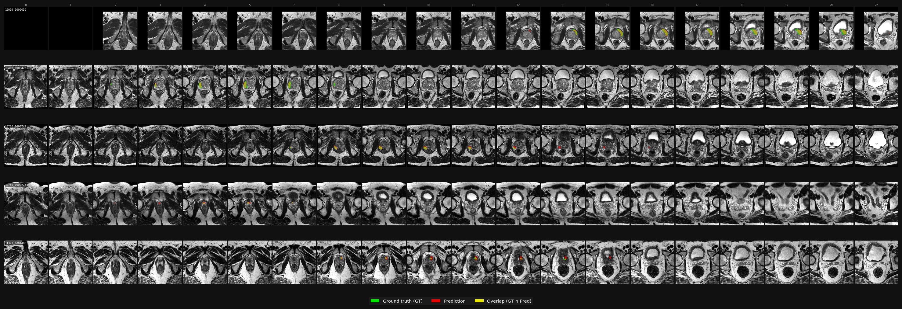
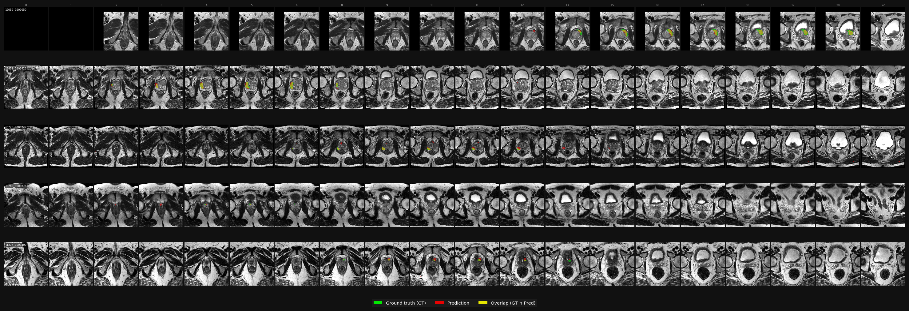
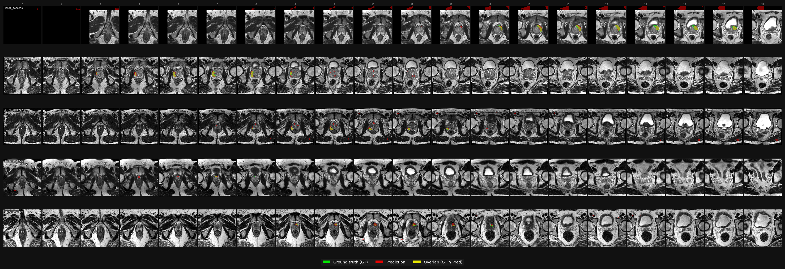
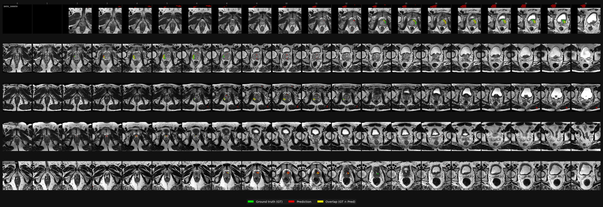

# Training Run Report

- generated_at: `2026-04-28 21:33:28`
- base_dir: `/home/ramals/School/ProstateLesionSegmentation/outputs/runs`
- runs: `8`
- sort_by: `best_composite_score`

## Comparison

| run | duration | stopped_epoch | best_epoch | best_composite | best_dice | best_iou | best_sens | best_prec | best_hd95 | model | loss | patch_size |
| --- | --- | --- | --- | --- | --- | --- | --- | --- | --- | --- | --- | --- |
| 20260415_210631_v3_multimodal | 2:41:19 | 74 | 14 | 0.5285 | 0.3182 | 0.2155 | 0.7893 | n/a | n/a | attention_unet3d | tversky_bce | (20, 128, 128) |
| 20260415_173357_v3_multimodal | 3:16:35 | 91 | 38 | 0.5278 | 0.3472 | 0.2423 | 0.7603 | n/a | n/a | attention_unet3d | tversky_bce | (20, 128, 128) |
| 20260418_224246_deconver | 7:19:20 | 139 | 122 | 0.4709 | 0.4067 | 0.2859 | 0.6567 | 0.4451 | 58.3092 | deconver | tversky_bce | (16, 128, 128) |
| 20260427_221309_unet3d | 13:25:46 | 300 | 276 | 0.4409 | 0.4152 | 0.3042 | 0.5181 | 0.5335 | 39.3815 | attention_unet3d | tversky_bce | (16, 128, 128) |
| 20260416_112700_v3_multimodal | 7:26:21 | 170 | 146 | 0.4323 | 0.3620 | 0.2547 | 0.6184 | 0.4602 | 55.2121 | attention_unet3d | tversky_bce | (20, 128, 128) |
| 20260416_193800_v3_multimodal | 12:08:57 | 300 | 206 | 0.4166 | 0.3732 | 0.2650 | 0.5171 | 0.4833 | 79.1391 | attention_unet3d | tversky_bce | (20, 128, 128) |
| 20260420_212454_deconver | 9:31:29 | 210 | 145 | 0.3970 | 0.3458 | 0.2420 | 0.5495 | 0.4670 | 54.6309 | deconver | tversky_bce | (16, 128, 128) |
| 20260426_104802_v3_multimodal | 2:10:08 | 150 | 118 | 0.3718 | 0.3108 | 0.2137 | 0.4736 | 0.4607 | 105.9377 | attention_unet3d | tversky_bce | (16, 128, 128) |

## 20260415_210631_v3_multimodal

- run_dir: `/home/ramals/School/ProstateLesionSegmentation/outputs/runs/20260415_210631_v3_multimodal`
- experiment_name: `v3_multimodal`
- git_commit: `unknown`
- config_source: `metadata.json`
- start_time: `2026-04-15 23:11:03`
- end_time: `2026-04-16 01:52:22`
- duration: `2:41:19`
- epochs: stopped=74, configured=300, best=14
- early_stopped: `True`

### Visualization
Loading orbit GIF (large file, may take a moment)... 

Loading evaluation image... 

### Evaluation
- checkpoint: `best.pt`
- test_cases: `10` (`5` positive, `5` negative)

| Metric | Value |
| --- | --- |
| dice | 0.1291 |
| iou | 0.0710 |
| sensitivity | 0.9552 |
| precision | 0.0715 |
| hd95 | 181.4493 |

### Training Validation Metrics
| Metric | Best | At Best Epoch | Last Val |
| --- | --- | --- | --- |
| composite_score | 0.5285 | 0.5285 | 0.4397 |
| dice | 0.3182 | 0.0938 | 0.2998 |
| iou | 0.2155 | 0.0544 | 0.1990 |
| sensitivity | 0.7893 | 0.7893 | 0.5237 |
| precision | n/a | n/a | n/a |
| hd95 | n/a | n/a | n/a |

### Config Highlights
- model: `attention_unet3d`
- features: `[32, 64, 128, 256]`
- loss: `tversky_bce` (alpha=0.3, beta=0.7, dice_weight=3.0, bce_weight=1.0, bce_pos_weight=50.0)
- patch_size: `[20, 128, 128]`
- target_spacing: `[3.0, 0.5, 0.5]`
- modalities: use_t2w=True, use_adc=True, use_hbv=True
- optimizer/schedule: lr=0.0004, weight_decay=1e-05, warmup_epochs=10
- train/val cadence: batch_size=16, epochs=300, val_every=2, val_start_epoch=n/a, val_compute_hd95_every=0
- best-checkpoint score weights: w_sensitivity=0.5, w_dice=0.3, w_hd95=0.0, hd95_scale=n/a
- early stopping: patience=30, min_delta=0.001
- runtime: use_amp=True, amp_dtype=fp16, use_compile=False
- encoder init: pretrained_encoder_checkpoint=n/a, freeze_encoder_epochs=n/a
- parameters: total=22,668,733, trainable=22,668,733

### Warnings
- metadata.json config differs from config.yaml; using metadata.json (mismatched keys: sw_batch_size).
- Using centralized eval PNG from visualizations directory: 20260415_210631_v3_multimodal_eval_visualization.png

## 20260415_173357_v3_multimodal

- run_dir: `/home/ramals/School/ProstateLesionSegmentation/outputs/runs/20260415_173357_v3_multimodal`
- experiment_name: `v3_multimodal`
- git_commit: `unknown`
- config_source: `metadata.json`
- start_time: `2026-04-15 19:38:30`
- end_time: `2026-04-15 22:55:05`
- duration: `3:16:35`
- epochs: stopped=91, configured=300, best=38
- early_stopped: `True`

### Visualization
Loading orbit GIF (large file, may take a moment)... 

Loading evaluation image... 

### Evaluation
- checkpoint: `best.pt`
- test_cases: `10` (`5` positive, `5` negative)

| Metric | Value |
| --- | --- |
| dice | 0.2306 |
| iou | 0.1313 |
| sensitivity | 0.7699 |
| precision | 0.1411 |
| hd95 | 174.3303 |

### Training Validation Metrics
| Metric | Best | At Best Epoch | Last Val |
| --- | --- | --- | --- |
| composite_score | 0.5278 | 0.5278 | 0.4357 |
| dice | 0.3472 | 0.1852 | 0.3472 |
| iou | 0.2423 | 0.1135 | 0.2423 |
| sensitivity | 0.7603 | 0.7334 | 0.4888 |
| precision | n/a | n/a | n/a |
| hd95 | n/a | n/a | n/a |

### Config Highlights
- model: `attention_unet3d`
- features: `[32, 64, 128, 256]`
- loss: `tversky_bce` (alpha=0.3, beta=0.7, dice_weight=3.0, bce_weight=1.0, bce_pos_weight=50.0)
- patch_size: `[20, 128, 128]`
- target_spacing: `[3.0, 0.5, 0.5]`
- modalities: use_t2w=True, use_adc=True, use_hbv=True
- optimizer/schedule: lr=0.0004, weight_decay=1e-05, warmup_epochs=10
- train/val cadence: batch_size=16, epochs=300, val_every=2, val_start_epoch=n/a, val_compute_hd95_every=0
- best-checkpoint score weights: w_sensitivity=0.5, w_dice=0.3, w_hd95=0.0, hd95_scale=n/a
- early stopping: patience=30, min_delta=0.001
- runtime: use_amp=True, amp_dtype=fp16, use_compile=False
- encoder init: pretrained_encoder_checkpoint=n/a, freeze_encoder_epochs=n/a
- parameters: total=22,668,733, trainable=22,668,733

### Warnings
- metadata.json config differs from config.yaml; using metadata.json (mismatched keys: sw_batch_size).
- Using centralized eval PNG from visualizations directory: 20260415_173357_v3_multimodal_eval_visualization.png

## 20260418_224246_deconver

- run_dir: `/home/ramals/School/ProstateLesionSegmentation/outputs/runs/20260418_224246_deconver`
- experiment_name: `v3_multimodal`
- git_commit: `unknown`
- config_source: `metadata.json`
- start_time: `2026-04-19 00:45:55`
- end_time: `2026-04-19 08:05:15`
- duration: `7:19:20`
- epochs: stopped=139, configured=300, best=122
- early_stopped: `True`

### Visualization
Loading orbit GIF (large file, may take a moment)... 

Loading evaluation image... 

### Evaluation
- checkpoint: `best.pt`
- test_cases: `10` (`5` positive, `5` negative)

| Metric | Value |
| --- | --- |
| dice | 0.6470 |
| iou | 0.4992 |
| sensitivity | 0.7732 |
| precision | 0.6525 |
| hd95 | 3.8062 |

### Training Validation Metrics
| Metric | Best | At Best Epoch | Last Val |
| --- | --- | --- | --- |
| composite_score | 0.4709 | 0.4709 | 0.4465 |
| dice | 0.4067 | 0.4067 | 0.3602 |
| iou | 0.2859 | 0.2859 | 0.2452 |
| sensitivity | 0.6567 | 0.5672 | 0.5760 |
| precision | 0.4451 | 0.3786 | 0.3142 |
| hd95 | 58.3092 | 82.1918 | 124.8797 |

### Config Highlights
- model: `deconver`
- features: `[32, 64, 128, 256]`
- loss: `tversky_bce` (alpha=0.3, beta=0.7, dice_weight=1.0, bce_weight=1.0, bce_pos_weight=10.0)
- patch_size: `[16, 128, 128]`
- target_spacing: `[3.0, 0.5, 0.5]`
- modalities: use_t2w=True, use_adc=True, use_hbv=True
- optimizer/schedule: lr=0.0004, weight_decay=1e-05, warmup_epochs=10
- train/val cadence: batch_size=12, epochs=300, val_every=2, val_start_epoch=100, val_compute_hd95_every=1
- best-checkpoint score weights: w_sensitivity=0.4, w_dice=0.6, w_hd95=0.0, hd95_scale=10.0
- early stopping: patience=50, min_delta=0.001
- runtime: use_amp=True, amp_dtype=bf16, use_compile=False
- encoder init: pretrained_encoder_checkpoint=n/a, freeze_encoder_epochs=n/a
- parameters: total=10,478,659, trainable=10,478,659

### Warnings
- metadata.json config differs from config.yaml; using metadata.json (mismatched keys: postprocess_connectivity, postprocess_enabled, postprocess_min_component_volume_mm3, pred_threshold, sw_batch_size).
- Using centralized eval PNG from visualizations directory: 20260418_224246_deconver_eval_visualization.png

## 20260427_221309_unet3d

- run_dir: `/home/ramals/School/ProstateLesionSegmentation/outputs/runs/20260427_221309_unet3d`
- experiment_name: `unet3d`
- git_commit: `unknown`
- config_source: `metadata.json`
- start_time: `2026-04-28 00:18:00`
- end_time: `2026-04-28 13:43:46`
- duration: `13:25:46`
- epochs: stopped=300, configured=300, best=276
- early_stopped: `False`

### Visualization
Loading orbit GIF (large file, may take a moment)... 

Loading evaluation image... 

### Evaluation
- checkpoint: `best.pt`
- test_cases: `10` (`5` positive, `5` negative)

| Metric | Value |
| --- | --- |
| dice | 0.6332 |
| iou | 0.4820 |
| sensitivity | 0.8329 |
| precision | 0.5876 |
| hd95 | 4.4875 |

### Training Validation Metrics
| Metric | Best | At Best Epoch | Last Val |
| --- | --- | --- | --- |
| composite_score | 0.4409 | 0.4409 | 0.4317 |
| dice | 0.4152 | 0.4133 | 0.4092 |
| iou | 0.3042 | 0.3016 | 0.2991 |
| sensitivity | 0.5181 | 0.5054 | 0.4840 |
| precision | 0.5335 | 0.4294 | 0.4500 |
| hd95 | 39.3815 | 55.2711 | 64.8517 |

### Config Highlights
- model: `attention_unet3d`
- features: `[64, 128, 256, 512]`
- loss: `tversky_bce` (alpha=0.3, beta=0.7, dice_weight=1.0, bce_weight=1.0, bce_pos_weight=10.0)
- patch_size: `[16, 128, 128]`
- target_spacing: `[3.0, 0.5, 0.5]`
- modalities: use_t2w=True, use_adc=True, use_hbv=True
- optimizer/schedule: lr=0.0004, weight_decay=1e-05, warmup_epochs=10
- train/val cadence: batch_size=8, epochs=300, val_every=2, val_start_epoch=50, val_compute_hd95_every=1
- best-checkpoint score weights: w_sensitivity=0.3, w_dice=0.7, w_hd95=0.0, hd95_scale=10.0
- early stopping: patience=50, min_delta=0.001
- runtime: use_amp=True, amp_dtype=fp16, use_compile=False
- encoder init: pretrained_encoder_checkpoint=./outputs/pretrain_runs/20260426_160028_ssl_pretrain_mae/checkpoints/best.pt, freeze_encoder_epochs=0
- parameters: total=90,654,448, trainable=90,654,448

### Warnings
- metadata.json config differs from config.yaml; using metadata.json (mismatched keys: sw_batch_size).
- Using centralized eval PNG from visualizations directory: 20260427_221309_unet3d_eval_visualization.png

## 20260416_112700_v3_multimodal

- run_dir: `/home/ramals/School/ProstateLesionSegmentation/outputs/runs/20260416_112700_v3_multimodal`
- experiment_name: `v3_multimodal`
- git_commit: `unknown`
- config_source: `metadata.json`
- start_time: `2026-04-16 13:31:35`
- end_time: `2026-04-16 20:57:56`
- duration: `7:26:21`
- epochs: stopped=170, configured=300, best=146
- early_stopped: `True`

### Visualization
Loading orbit GIF (large file, may take a moment)... 

Loading evaluation image... 

### Evaluation
- checkpoint: `best.pt`
- test_cases: `10` (`5` positive, `5` negative)

| Metric | Value |
| --- | --- |
| dice | 0.5914 |
| iou | 0.4425 |
| sensitivity | 0.6959 |
| precision | 0.5456 |
| hd95 | 70.5337 |

### Training Validation Metrics
| Metric | Best | At Best Epoch | Last Val |
| --- | --- | --- | --- |
| composite_score | 0.4323 | 0.4323 | 0.3969 |
| dice | 0.3620 | 0.3481 | 0.3464 |
| iou | 0.2547 | 0.2405 | 0.2393 |
| sensitivity | 0.6184 | 0.5585 | 0.4727 |
| precision | 0.4602 | 0.3052 | 0.3332 |
| hd95 | 55.2121 | 83.8742 | 119.6348 |

### Config Highlights
- model: `attention_unet3d`
- features: `[32, 64, 128, 256]`
- loss: `tversky_bce` (alpha=0.3, beta=0.7, dice_weight=1.0, bce_weight=1.0, bce_pos_weight=10.0)
- patch_size: `[20, 128, 128]`
- target_spacing: `[3.0, 0.5, 0.5]`
- modalities: use_t2w=True, use_adc=True, use_hbv=True
- optimizer/schedule: lr=0.0004, weight_decay=1e-05, warmup_epochs=10
- train/val cadence: batch_size=16, epochs=300, val_every=2, val_start_epoch=n/a, val_compute_hd95_every=1
- best-checkpoint score weights: w_sensitivity=0.4, w_dice=0.6, w_hd95=0.0, hd95_scale=10.0
- early stopping: patience=50, min_delta=0.001
- runtime: use_amp=True, amp_dtype=fp16, use_compile=False
- encoder init: pretrained_encoder_checkpoint=n/a, freeze_encoder_epochs=n/a
- parameters: total=22,669,184, trainable=22,669,184

### Warnings
- metadata.json config differs from config.yaml; using metadata.json (mismatched keys: sw_batch_size).
- Using centralized eval PNG from visualizations directory: 20260416_112700_v3_multimodal_eval_visualization.png

## 20260416_193800_v3_multimodal

- run_dir: `/home/ramals/School/ProstateLesionSegmentation/outputs/runs/20260416_193800_v3_multimodal`
- experiment_name: `v3_multimodal`
- git_commit: `unknown`
- config_source: `metadata.json`
- start_time: `2026-04-16 21:42:57`
- end_time: `2026-04-17 09:51:54`
- duration: `12:08:57`
- epochs: stopped=300, configured=300, best=206
- early_stopped: `False`

### Visualization
Loading orbit GIF (large file, may take a moment)... 

Loading evaluation image... 

### Evaluation
- checkpoint: `best.pt`
- test_cases: `10` (`5` positive, `5` negative)

| Metric | Value |
| --- | --- |
| dice | 0.4731 |
| iou | 0.3210 |
| sensitivity | 0.8639 |
| precision | 0.3366 |
| hd95 | 146.2931 |

### Training Validation Metrics
| Metric | Best | At Best Epoch | Last Val |
| --- | --- | --- | --- |
| composite_score | 0.4166 | 0.4166 | 0.4017 |
| dice | 0.3732 | 0.3496 | 0.3688 |
| iou | 0.2650 | 0.2418 | 0.2612 |
| sensitivity | 0.5171 | 0.5171 | 0.4512 |
| precision | 0.4833 | 0.3221 | 0.4064 |
| hd95 | 79.1391 | 129.0608 | 88.7216 |

### Config Highlights
- model: `attention_unet3d`
- features: `[32, 64, 128, 256]`
- loss: `tversky_bce` (alpha=0.3, beta=0.7, dice_weight=1.0, bce_weight=1.0, bce_pos_weight=10.0)
- patch_size: `[20, 128, 128]`
- target_spacing: `[3.0, 0.5, 0.5]`
- modalities: use_t2w=True, use_adc=True, use_hbv=True
- optimizer/schedule: lr=0.0004, weight_decay=1e-05, warmup_epochs=10
- train/val cadence: batch_size=16, epochs=300, val_every=2, val_start_epoch=100, val_compute_hd95_every=1
- best-checkpoint score weights: w_sensitivity=0.4, w_dice=0.6, w_hd95=0.0, hd95_scale=10.0
- early stopping: patience=50, min_delta=0.001
- runtime: use_amp=True, amp_dtype=fp16, use_compile=False
- encoder init: pretrained_encoder_checkpoint=n/a, freeze_encoder_epochs=n/a
- parameters: total=22,669,184, trainable=22,669,184

### Warnings
- metadata.json config differs from config.yaml; using metadata.json (mismatched keys: sw_batch_size).
- Using centralized eval PNG from visualizations directory: 20260416_193800_v3_multimodal_eval_visualization.png

## 20260420_212454_deconver

- run_dir: `/home/ramals/School/ProstateLesionSegmentation/outputs/runs/20260420_212454_deconver`
- experiment_name: `deconver`
- git_commit: `unknown`
- config_source: `metadata.json`
- start_time: `2026-04-20 23:29:37`
- end_time: `2026-04-21 09:01:06`
- duration: `9:31:29`
- epochs: stopped=210, configured=300, best=145
- early_stopped: `True`

### Visualization
Loading orbit GIF (large file, may take a moment)... 

Loading evaluation image... 

### Evaluation
- checkpoint: `best.pt`
- test_cases: `10` (`5` positive, `5` negative)

| Metric | Value |
| --- | --- |
| dice | 0.6143 |
| iou | 0.4644 |
| sensitivity | 0.8629 |
| precision | 0.5184 |
| hd95 | 12.8735 |

### Training Validation Metrics
| Metric | Best | At Best Epoch | Last Val |
| --- | --- | --- | --- |
| composite_score | 0.3970 | 0.3970 | 0.3775 |
| dice | 0.3458 | 0.2953 | 0.3458 |
| iou | 0.2420 | 0.1970 | 0.2420 |
| sensitivity | 0.5495 | 0.5495 | 0.4250 |
| precision | 0.4670 | 0.2501 | 0.3751 |
| hd95 | 54.6309 | 130.5263 | 96.8266 |

### Config Highlights
- model: `deconver`
- features: `[32, 64, 128, 256]`
- loss: `tversky_bce` (alpha=0.3, beta=0.7, dice_weight=1.0, bce_weight=1.0, bce_pos_weight=10.0)
- patch_size: `[16, 128, 128]`
- target_spacing: `[3.0, 0.5, 0.5]`
- modalities: use_t2w=True, use_adc=True, use_hbv=False
- optimizer/schedule: lr=0.0004, weight_decay=1e-05, warmup_epochs=10
- train/val cadence: batch_size=12, epochs=300, val_every=5, val_start_epoch=100, val_compute_hd95_every=1
- best-checkpoint score weights: w_sensitivity=0.4, w_dice=0.6, w_hd95=0.0, hd95_scale=10.0
- early stopping: patience=50, min_delta=0.001
- runtime: use_amp=True, amp_dtype=bf16, use_compile=False
- encoder init: pretrained_encoder_checkpoint=n/a, freeze_encoder_epochs=n/a
- parameters: total=10,476,931, trainable=10,476,931

### Warnings
- metadata.json config differs from config.yaml; using metadata.json (mismatched keys: postprocess_connectivity, postprocess_enabled, postprocess_min_component_volume_mm3, pred_threshold, sw_batch_size).
- Using centralized eval PNG from visualizations directory: 20260420_212454_deconver_eval_visualization.png

## 20260426_104802_v3_multimodal

- run_dir: `/home/ramals/School/ProstateLesionSegmentation/outputs/runs/20260426_104802_v3_multimodal`
- experiment_name: `v3_multimodal`
- git_commit: `unknown`
- config_source: `metadata.json`
- start_time: `2026-04-26 12:52:44`
- end_time: `2026-04-26 15:02:52`
- duration: `2:10:08`
- epochs: stopped=150, configured=300, best=118
- early_stopped: `True`

### Visualization
Loading orbit GIF (large file, may take a moment)... 

Loading evaluation image... 

### Evaluation
- checkpoint: `best.pt`
- test_cases: `10` (`5` positive, `5` negative)

| Metric | Value |
| --- | --- |
| dice | 0.4864 |
| iou | 0.3297 |
| sensitivity | 0.7604 |
| precision | 0.3875 |
| hd95 | 130.5286 |

### Training Validation Metrics
| Metric | Best | At Best Epoch | Last Val |
| --- | --- | --- | --- |
| composite_score | 0.3718 | 0.3718 | 0.3024 |
| dice | 0.3108 | 0.3084 | 0.2831 |
| iou | 0.2137 | 0.2099 | 0.1982 |
| sensitivity | 0.4736 | 0.4669 | 0.3314 |
| precision | 0.4607 | 0.2926 | 0.3636 |
| hd95 | 105.9377 | 137.1890 | 148.0802 |

### Config Highlights
- model: `attention_unet3d`
- features: `[32, 64, 128, 256]`
- loss: `tversky_bce` (alpha=0.3, beta=0.7, dice_weight=1.0, bce_weight=1.0, bce_pos_weight=10.0)
- patch_size: `[16, 128, 128]`
- target_spacing: `[3.0, 0.5, 0.5]`
- modalities: use_t2w=True, use_adc=True, use_hbv=True
- optimizer/schedule: lr=0.0004, weight_decay=1e-05, warmup_epochs=10
- train/val cadence: batch_size=16, epochs=300, val_every=2, val_start_epoch=100, val_compute_hd95_every=1
- best-checkpoint score weights: w_sensitivity=0.4, w_dice=0.6, w_hd95=0.0, hd95_scale=10.0
- early stopping: patience=50, min_delta=0.001
- runtime: use_amp=True, amp_dtype=fp16, use_compile=False
- encoder init: pretrained_encoder_checkpoint=, freeze_encoder_epochs=0
- parameters: total=22,669,184, trainable=22,669,184

### Warnings
- metadata.json config differs from config.yaml; using metadata.json (mismatched keys: sw_batch_size).
- Using centralized eval PNG from visualizations directory: 20260426_104802_v3_multimodal_eval_visualization.png
